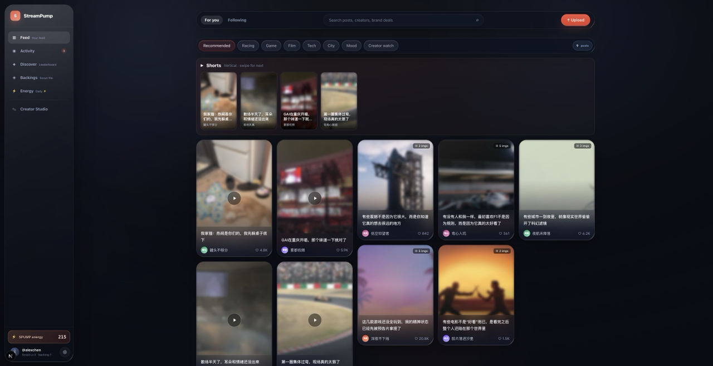
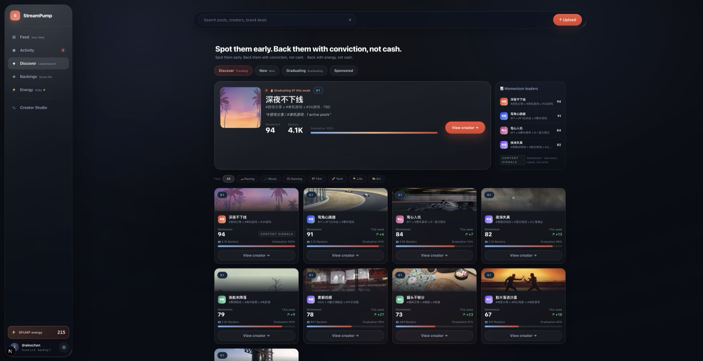
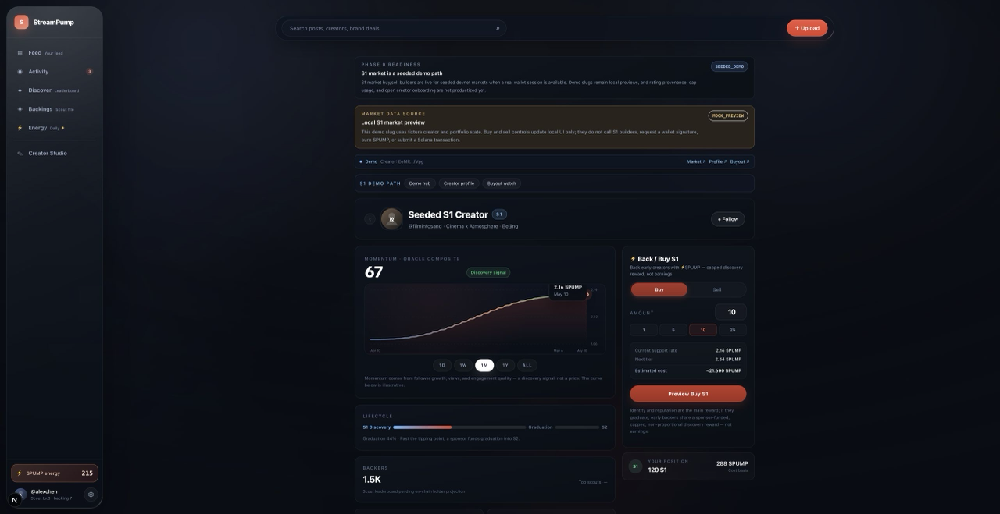
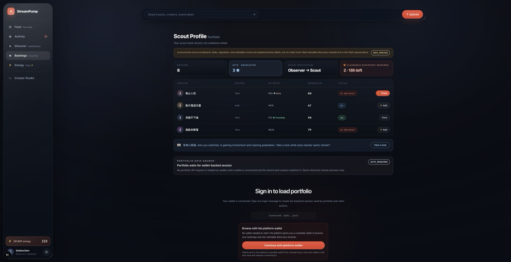
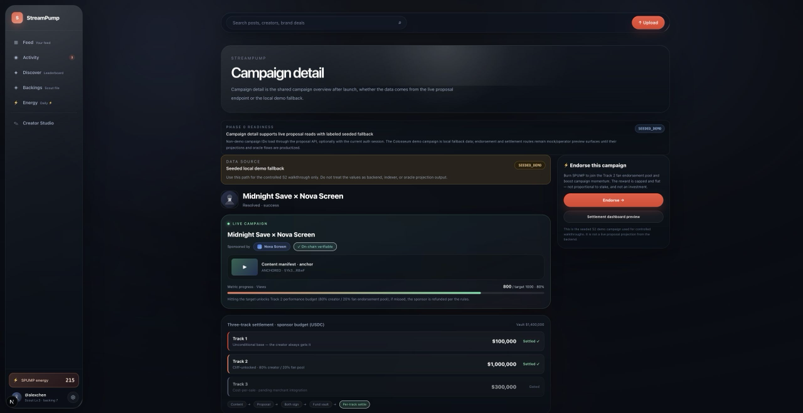
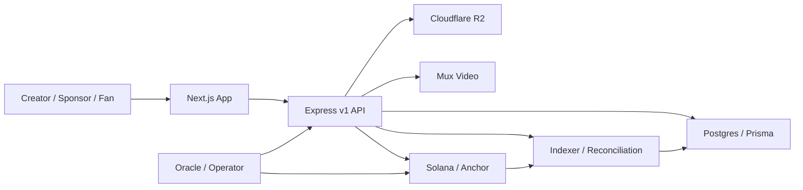

<p align="center">
  <h1 align="center">🎬 StreamPump</h1>
  <p align="center">
    <strong>The Web2.5 trust layer for creator sponsorship — where content, creator momentum, fan participation, and sponsor budgets settle on Solana in one product loop.</strong>
  </p>
  <p align="center">
    
    
    
    
    
  </p>
  <p align="center">
    <a href="README.zh-CN.md">🇨🇳 中文版 README</a>
  </p>
  
</p>

---

## 📋 Table of Contents

- [What Is This?](#-what-is-this)
- [Why StreamPump Is Different](#-why-streampump-is-different)
- [Features](#-features)
- [Screenshots](#-screenshots)
- [Product Model](#-product-model)
- [How It Works](#-how-it-works)
- [Why Solana](#-why-solana)
- [Current Status](#-current-status)
- [Repository Layout](#-repository-layout)
- [Quick Start](#-quick-start)
- [Tech Stack](#-tech-stack)
- [Demo Path](#-demo-path)
- [Testing](#-testing)
- [Deployment](#-deployment)
- [Roadmap](#-roadmap)
- [Documentation Index](#-documentation-index)
- [Security & Git Safety](#-security--git-safety)
- [License](#-license)

---

## ✨ What Is This?

**StreamPump** is a Web2.5 creator sponsorship market built on Solana. It places content creation, creator momentum, sponsor budgets, fan participation, and on-chain settlement into a single product loop.

It is **not** a fan-token casino, **not** an influencer CRM, and **not** a view-to-earn reward farm. It is the **trust layer** between three groups who currently lack one:

- **Creators** get cold-start funding from fans, then graduate into structured sponsorship deals with guaranteed base pay *and* performance upside.
- **Fans / backers** support creators early with non-transferable `SPUMP`, and earn permanent founding status plus a **capped, sponsor-funded discovery reward** when a creator they backed graduates — never a stake-proportional return or secondary-market speculation.
- **Sponsors** reach creators directly (no agency middlemen) through three flexible USDC budget tracks, and receive verifiable on-chain campaign proof.

```text
content → creator momentum → fan participation → sponsor USDC budget → Solana settlement
```

> **Design principle:** DB-first for product workflow, chain-first for financial truth. Drafts, uploads, manifests, and intents live in Postgres; funding, settlement, and token movement are Solana truth.

---

## 🔥 Why StreamPump Is Different

The creator economy is projected to reach **$480B by 2027** (Goldman Sachs), with **$37B** in US creator ad spend (IAB 2025), and **73%** of brands now prefer micro and mid-tier creators over mega-influencers. The demand is here — **the missing layer is trust.**

Web3 has tried to capture this and mostly failed, for structural reasons:

| Project | What happened |
|---|---|
| **Friend.tech** | ~80k DAU → **<10k**; revenue collapsed to **$71**; contract abandoned |
| **Farcaster** | Raised **$150M**; signups dropped **15k/mo → 545/mo** |
| **Lens Protocol** | New users **37k/mo → 142/mo** — a **99.6%** collapse |

Three structural failures killed them: **token-first instead of product-first**, **view-to-earn death spirals** (earn token → dump on DEX → price crashes → users leave), and **fake content ownership** nobody actually wanted.

StreamPump is built on four convictions that avoid every one of these traps:

| Conviction | What it means |
|---|---|
| 🎥 **Content is the asset** | Videos and posts retain audiences — meme coins and NFTs only attract speculators. We don't claim to own or tokenize content; the chain holds a creator-signed publication timestamp + attribution that routes revenue, while content stays on the creator's own platforms |
| 🔒 **`SPUMP` is utility-only** | Non-transferable Token-2022; never listed on DEX/CEX. Backing is skin in the game **priced in time and attention, not money** — non-transferability is the mechanism that makes it a credible conviction signal, not a compromise |
| 💼 **Sponsors are marketing spenders** | Campaign budgets, not speculative capital — a far healthier funding source |
| ⚙️ **Automated by design** | No bloated team or extractive tokenomics; service fees + small USDC tx fees keep the lights on |

---

## 🎯 Features

| Feature | Description |
|---|---|
| 🚀 **S1 Creator Discovery** | Fans burn `SPUMP` into rating-adjusted bonding-curve positions to back creators early |
| 🤝 **S1 → S2 Buyout Bridge** | Sponsors bid USDC to buy out a creator; the creator takes the majority, while backers rage-quit or claim a capped, decoupled discovery reward at graduation |
| 📊 **Three-Track Sponsorship** | Fixed base pay, performance budget, and delayed CPS — all settled per track on-chain |
| 🗳️ **Fan Endorsement Pool** | Fans burn `SPUMP` to endorse campaigns and earn a capped, flat USDC reward from the Track 2 performance pool |
| 🔗 **Verifiable Campaign Proof** | Every campaign exposes its PDA, tx signature, manifest hash, and content anchor |
| 👛 **Web2.5 Managed Wallets** | Email/social users get a platform-custodied wallet — backend signs and pays, zero SOL required |
| 🛡️ **Anti-Speculation Guardrails** | Non-transferable token, daily buy caps, dynamic exit tax, delayed ratings, endorsement caps |
| 🎞️ **Real Media Pipeline** | Cloudflare R2 storage + Mux video processing + publication verification before public feed |

> **Boundary — these are protocol/code capabilities, not current Pilot availability.** The invite-only Pilot candidate is devnet/test-USDC only and is **not deployed, not live, no real funds**. The only lane open to Pilot users is external-wallet auth → media → feed → proposal intent → creator + sponsor dual sign → backend relay → manual Track 1 → campaign proof. S1 discovery/buyout, the fan endorsement pool, Track 2/3 settlement, and managed/email-social wallets exist in code but are **closed for all Pilot users** (see [Current Status](#-current-status)).

---

## 📸 Screenshots

| Trending Creators | S1 Creator Market |
|---|---|
|  |  |

| Portfolio & Claim | Campaign Proof |
|---|---|
|  |  |

---

## 🧩 Product Model

StreamPump has two connected product layers.

### Season 1 — Creator Discovery Market

S1 is the discovery layer where early creators bootstrap commercial value. A fan burns `SPUMP` (non-transferable Token-2022) and receives an **internal creator position** recorded as a PDA in `S1UserPosition` — *not* a tradable SPL token. Price moves along a quadratic bonding curve scaled by an oracle-evaluated momentum rating:

```text
effective_k = base_k * creator_rating_bps / 10_000
buy cost    = effective_k / 2 * ((S + dS)^2 - S^2)
sell return = effective_k / 2 * (S^2 - (S - dS)^2)
```

Default rating is `10_000` (1.0×), bounded `5_000`–`20_000` (0.5×–2.0×), with daily change caps and delayed activation. When a creator reaches critical mass, sponsors submit **buyout offers**; after creator acceptance and a rage-quit window, **graduation** executes — the creator receives the majority of the buyout USDC, and remaining backers claim a **capped, non-proportional discovery reward** (by eligibility, earliness, or loyalty — never scaled by SPUMP staked).

> See [docs/protocol/s1-market-design.md](docs/protocol/s1-market-design.md) for parameters and anti-arbitrage guardrails.

### Season 2 — Sponsored Campaign Market

Sponsors fund campaigns through three budget tracks:

| Track | Model | Settlement |
|---|---|---|
| **Track 1** | Fixed base pay | Unconditional creator payout |
| **Track 2** | Performance budget | Cliff threshold; above it, 80% creator / 20% fan endorsement pool |
| **Track 3** | CPS (cost per sale) | Delayed settlement after the refund window closes |

The launch experience is DB-first until money must move, then chain-first for final truth:

```text
wallet session
  → content manifest
  → proposal intent
  → creator partial signature
  → sponsor final signature
  → Solana proposal + funded vault
  → per-track settlement
```

### Loyalty & Fan Badges (design)

> 🧭 **Design / planned — not implemented yet.** Spec: [docs/protocol/fan-loyalty-and-spump-economy.md](docs/protocol/fan-loyalty-and-spump-economy.md).

A loyalty layer sits on top of S1/S2 to make early-fan status concrete and to give `SPUMP` always-available sinks. Each fan holds a per-creator **soulbound Fan Badge** that levels up from following duration plus engagement, with a permanent **Founding Backer #N** rank for early-cohort backers. `SPUMP` is positioned as conviction/voice — not money — so non-transferability is a feature: because it can only be earned over time, spending it is a credible signal of real conviction. Badge tier claims, cheers, content boosts, and perk unlocks burn `SPUMP`, decoupling its usefulness from "is there a creator worth backing right now," and per-creator S1 daily caps scale with badge tier so loyalty (not capital) earns backing priority.

### Platform Level & Scout Influence (design)

> 🧭 **Design / planned — phase 1 read-only skeleton (MOCK_PREVIEW).** Spec: [docs/protocol/user-influence-and-leveling.md](docs/protocol/user-influence-and-leveling.md).

Users earn two axes of standing: **Level (Lv0–Lv6)** — the Bilibili-familiar seniority/trust grind, and a **Scout title badge** (Passerby → Observer → Scout → Gold Scout / 路人 → 观察者 → 星探 → 金牌伯乐) earned when creators you discovered early actually grow. Users see **one primary number (Level) + one earned title (Scout)** — never two competing XP bars.

Higher-standing users' likes, cheers, and endorsements allocate **more discovery traffic** and contribute more to a creator's momentum. Critically, influence is a **reputation/discovery currency, not a financial one** — weighting moves traffic, ranking, and a displayed momentum score freely, but can reach creator *valuation* only as bounded, oracle-mediated evidence (never a direct multiplier on price, claims, or USDC). Weight is sublinear and capped, everyone starts at a full base, and standing is non-transferable and unbuyable — keeping the curation economy legitimate rather than oligarchic, and consistent with the compliance firewall.

---

## 🏗 How It Works



- **DB-first for workflow:** drafts, manifests, uploads, media processing, proposal intents, retries, workspace state.
- **Chain-first for truth:** sponsor funding, proposal creation, settlement, refunds, token mint/burn, immutable content anchors.

The Anchor program ships **35 type-safe instructions** and **13 PDA account types** covering the full lifecycle — S1 discovery, S1 buyout, S2 campaigns, three-track settlement, content anchoring, and protocol/user/org state.

---

## ⚡ Why Solana

Every core mechanism depends on a specific Solana capability — this is not a marketing choice:

| Capability | Why it matters |
|---|---|
| **~400ms finality** | S1 bonding-curve buy/sell must confirm instantly for usable UX |
| **Sub-cent fees** | Makes Track 2 micro-settlements and Track 3 CPS payouts economically viable |
| **Token-2022 NonTransferable** | Enforces `SPUMP` non-transferability at the protocol level, not by convention |
| **PDA architecture** | Config, profiles, S1 positions, proposals, and USDC vaults are deterministic, verifiable on-chain state |
| **Anchor framework** | 35 type-safe instructions for the entire product lifecycle in one program |
| **Ecosystem** | Wallet adapters, Web3Auth social login, mature RPC, and devnet for fast iteration |

---

## 📍 Current Status

StreamPump is currently a **code-verified invite-only Pilot candidate — not a deployed production system and not live.** H0 and H1 human gates are approved; the P2 corridor-truth work (`d78815b..5ad0065`) is a **local review candidate** awaiting Fable 5 review and human gate H2. All chain activity targets **Solana devnet with a test-USDC mint; no real funds are ever involved.** The end-to-end corridor (external-wallet creator → media upload → public feed → proposal → dual-signature launch → backend relay → manual Track 1 → on-chain campaign proof) is code-verified on devnet, not deployed. Readiness labels are kept honest.

### Invite-Only Pilot (P1) — candidate, not a live launch

Access is gated by an **external real-wallet allowlist**. The auth challenge is identical in shape for every valid wallet, and the invite check runs **only after a valid signature** — the allowlist cannot be probed in advance.

**Open in the Pilot corridor:** external wallet authentication; content creation and upload through R2/Mux to completion; public feed and post-detail projection; proposal intent creation; creator + sponsor dual signature; backend relay of the fully signed transaction; manual Track 1 fixed-base settlement; campaign proof as projection/on-chain evidence (PDA, tx signature, manifest hash, content anchor).

**Closed for all Pilot users:** email/social/provider managed-wallet auth and public managed execution; S1 market/buyout/portfolio claim; Track 2 endorsement and fan rewards; Track 3 CPS; daily and engagement rewards; automatic oracle settlement schedulers; prototype/legacy routes.

**Content truth (P2).** Uploads land in a **private R2 origin bucket** used only for presigned staging and KYB docs; a **distinct public delivery bucket** (`R2_DELIVERY_BUCKET`, required to differ from `R2_BUCKET`) holds only verified/trusted media. The backend records **server-observed bytes, MIME, size, and SHA-256** for each asset, enforces a **serialized monthly upload quota**, runs **Mux reconciliation**, then promotes verified assets to delivery and cleans up the origin copy. A **creator cannot self-verify** their own content — **operator approval is required** before feed eligibility.

**API idempotency (P2).** Content and proposal-intent mutations are guarded by **durable, database-backed idempotency keys**, so retried mutations replay the stored result instead of duplicating on-chain or DB effects.

**Proposal truth (P2).** A proposal can only launch from a **feed-eligible, immutable manifest** with a **positive Track 1 budget** and **both creator and sponsor signatures**, and the backend confirms the **on-chain state matches** the stored terms. **Track 2 and Track 3 must be zero**; a proposal with a partially configured Track 2/3 is **rejected**.

**Track 1 settlement truth (P2).** Manual Track 1 operator settlement is **evidence-bound, idempotent, lease-fenced, and signature-verified**; the campaign proof **separates anchor, funding, and settlement signatures**. Historical, unprovable anchor-tx signatures were **cleared by migration** rather than presented as proof.

**Not claimed** (do not represent these as done): independent third-party publication verification; program-side allowlist enforcement; security audit; production deployment; real funds.

**Production-listen gate (fail-closed).** In production the backend refuses to start unless every active RPC reports the full Solana devnet genesis hash, the configured program account exists and is `executable`, and on-chain `ProtocolConfig.usdcMint` exactly equals `PILOT_EXPECTED_USDC_MINT`. Governing env: `PILOT_INVITE_ONLY`, `PILOT_INVITE_WALLETS`, `PILOT_EXPECTED_USDC_MINT`, `PILOT_CHAIN_PREFLIGHT_TIMEOUT_MS`. New P2 runtime/config: `R2_DELIVERY_BUCKET` (must differ from `R2_BUCKET`), an internal `INTERNAL_OPERATOR_API_KEY` operator key, `INDEXER_ENABLED`/`MUX_RECONCILIATION_ENABLED` gates, and a **packaged production IDL** shipped under the backend root (`STREAMPUMP_IDL_PATH=./idl/streampump_core.json`).

**Verification.** P0 safety fixes (`5a7f355..6ee771e`) passed a Fable 5 review; human gate **H0 approved**. P1 backend hardening (`b393bac`) passed Fable 5 review; human gate **H1 approved**. **P2 (`d78815b..5ad0065`) is now a local review candidate — implemented and verified locally, but not deployed and not live for real funds.** Verified locally: Prisma generate + validate; backend build; **150 backend tests**; the production-IDL verifier (**35 instructions / 13 accounts / 66 types**); Anchor build; **12 key local chain tests**; app lint + build; and `git diff --check`. The final Opus UI truth fix (`5ad0065`) corrects onboarding external-wallet/Track 1 copy, carries no preview/seeded badge, and removes portfolio/rewards from normal Pilot navigation (legacy routes remain labeled and direct-link only). Browser-verified in the in-app Browser on `/onboarding` and `/campaigns/not-a-pda` at desktop and 390px mobile: clean console, no framework overlay or horizontal overflow, external-wallet login navigation works, and the campaign error is fail-closed with no local fallback. **Real production-corridor and Track 1 smoke were NOT executed** because live Pilot credentials and a live proposal were unavailable — the smoke scripts fail closed with explicit blockers, so the corridor is **not** yet called live or production-ready.

**Next gate:** the fixed P2 range → an independent **Fable 5** review → close any blocker/major finding and rerun → then **human gate H2**. Fable review and H2 have **not** passed yet.

**Remaining blockers before a real Pilot launch:** a real dedicated devnet RPC; a decided Pilot test-USDC mint; a real deployment chain preflight; a deployed-corridor + Track 1 smoke with live credentials; and external security audit + legal review.

| Area | Readiness | What's real now |
|---|---|---|
| **Pilot corridor (invite-only)** | Code-verified on devnet · not deployed | External-wallet auth → R2/Mux media → feed → proposal intent → dual sign → backend relay → manual Track 1 → campaign proof |
| **S1 market / portfolio / buyout** | Closed for Pilot (`SEEDED_DEMO` in code) | Buy/sell/claim/buyout code exists against seeded devnet state but is disabled for Pilot users |
| **S2 proposal launch** | Code-verified on devnet | Dual-sign launch corridor verified; the only money-flow open in the Pilot |
| **S2 endorsement** | Closed for Pilot (`BACKEND_READY_UI_GAP` in code) | On-chain burn + backend builders exist for seeded proposals but are disabled for Pilot users |
| **Settlement Track 1 (manual)** | `OPERATOR_REQUIRED` | Pilot allows the manual fixed-base payout only; no automatic settlement |
| **Settlement Track 2/3 (CPS)** | Closed for Pilot | Track 2 endorsement + Track 3 CPS disabled for Pilot users; Track 3 still needs a real merchant/reconciliation provider |
| **Managed wallet / email-social auth** | Closed for Pilot | Disabled for all Pilot users; external real wallets only |
| **Rewards** | Closed for Pilot | Daily/engagement/fan rewards disabled for Pilot users |
| **Operator tooling** | `OPERATOR_REQUIRED` | Internal routes exist; no dashboards yet |

> ⚠️ The Anchor program is **not audited** and **not deployed for production**. This build is an invite-only Pilot candidate on devnet/test-USDC only — **not live and no real funds**. The new chain guards and reward behavior require program deployment before they are live on-chain.

### Compliance & token posture (design in progress)

`SPUMP` is a non-transferable utility/consumption unit with no monetary value and no expectation of profit. To keep backing a costly conviction signal **without** it being an investment contract, the backer USDC mechanism has been redesigned from a *pro-rata share of the buyout* into a **capped, sponsor-funded discovery reward that does not scale with `SPUMP` staked** (the creator receives the majority of the buyout), with permanent founding status — not USDC — as the headline reward. This redesign is **implemented at the code level on the working branch** and is **gated** behind an Anchor audit, a legal token-classification opinion, program deployment, geofencing, and KYC for USDC-receiving users before any public, real-money launch. See [docs/protocol/spump-compliance-and-value-model.md](docs/protocol/spump-compliance-and-value-model.md). Until those gates clear, treat all USDC reward flows as demo/seeded only.

For the full picture see [docs/streamPump-long-term-roadmap.md](docs/streamPump-long-term-roadmap.md) (canonical roadmap + progress ledger) and [docs/product-readiness-phase-0.md](docs/product-readiness-phase-0.md).

---

## 📦 Repository Layout

| Path | Role |
|---|---|
| `programs/streampump-core` | Anchor program: protocol state, S1, S1 buyout, S2 three-track settlement, content anchoring |
| `programs/tests` | 10 Anchor TypeScript suites (happy/unhappy paths, guards, buyout, S2 flows) |
| `backend` | Express v1 API, Prisma (23 models / 20 migrations), R2/Mux, auth, indexer, schedulers, projections |
| `app` | Next.js 15 frontend: discovery, creator, portfolio, workspace, campaign, and auth surfaces |
| `docs` | Protocol design, backend API contracts, frontend specs, deployment notes, roadmap |
| `scripts` | Devnet seed, demo, smoke, deploy, and git-hook scripts |
| `local-post-assets` | Local seed media for dev feeds and media smoke tests |
| `third_party` | Vendored Rust dependencies for the Anchor workspace |

---

## 🚀 Quick Start

**Prerequisites:** Node.js 20+, npm, Rust toolchain, Solana CLI + Anchor (for on-chain tests), Postgres.

```bash
# Install dependencies (three separate targets — no monorepo tool)
npm install
npm install --prefix app
npm install --prefix backend

# Create local env files (fill secrets only in .env.local — Git-ignored)
cp app/.env.example app/.env.local
cp backend/.env.example backend/.env.local
```

### Frontend

```bash
cd app
npm run dev          # http://localhost:3000
```

Key env vars:

```text
NEXT_PUBLIC_BACKEND_BASE_URL=http://localhost:4000
NEXT_PUBLIC_RPC_ENDPOINT=https://api.devnet.solana.com
NEXT_IMAGE_REMOTE_HOSTS=pub-b0acd300bcec4dc5ba5ea36628dd809f.r2.dev
NEXT_PUBLIC_WEB3AUTH_CLIENT_ID=...
```

The frontend derives `/api/v1` from `NEXT_PUBLIC_BACKEND_BASE_URL` automatically.

### Backend

```bash
cd backend
npm run prisma:generate
npm run build
npm run dev          # http://localhost:4000
```

Common env vars: `DATABASE_URL`, `DIRECT_URL`, `AUTH_SESSION_SECRET`, `SOLANA_RPC_ENDPOINT`, `STREAMPUMP_PROGRAM_ID`, `R2_*`, `MUX_*`, `MANAGED_WALLET_ENCRYPTION_KEY`. See [docs/backend/env-and-vendor-guide.md](docs/backend/env-and-vendor-guide.md).

### On-chain Program

```bash
npm run build:anchor   # artifacts go to /private/tmp to avoid macOS file-provider stalls
anchor test
cargo check            # lighter type check
```

---

## 🛠 Tech Stack

| Layer | Technology |
|---|---|
| **Solana program** | Rust + Anchor 0.32, Solana CLI 2.3.0, Token-2022 (NonTransferable mint) |
| **Backend** | Express 4, TypeScript 5, Prisma 6, PostgreSQL |
| **Frontend** | Next.js 15, React 18, Tailwind CSS 3, TypeScript 5 |
| **Object storage** | Cloudflare R2 (via AWS SDK S3 transport) |
| **Video** | Mux (upload, webhook, reconciliation, HLS) |
| **Auth** | Wallet adapters (Phantom, Solflare), Web3Auth, email OTP, wallet challenge |
| **Deployment** | Vercel (app), Render (backend), Neon (DB), Cloudflare R2, Mux |
| **Program ID** | `FYphzoVLs1MB7aqHbGeT2DjqwTz1d6yyhtKXzvmjiDmp` |

---

## 🎬 Demo Path

> These are **legacy controlled demos** — seeded/operator walkthroughs kept for reference on devnet/test-USDC. They are a superset of the invite-only Pilot corridor and are not, by themselves, current Pilot availability, deployed, or live.

The legacy controlled demo is intentionally scoped to two controlled flows:

```text
S1 controlled demo
  → seed devnet S1 market + graduated buyout
  → open /market/:creatorWallet → buy/sell S1 with wallet session
  → open /buyout/:creatorWallet → claim USDC from a seeded holder position
  → verify /portfolio read model

S2 campaign demo
  → wallet sign-in → content manifest → proposal intent
  → creator signs launch bundle once → sponsor signs and submits once
  → confirmed Solana campaign
  → campaign detail shows PDA, tx signature, manifest hash, content anchor, track state
```

See [DEMO.md](DEMO.md) for the exact runbook, env toggles, seed scripts, and acceptance checklist.

> **Boundary:** S1 buyout formation and S2 Track 3 reconciliation are operator/seed-prepared for the demo, not presented as live external integrations.

---

## 🧪 Testing

```bash
npm run build --prefix app
npm run build --prefix backend
cargo check
npm run test:backend        # 15 backend suites
npm run test:anchor         # 10 Anchor suites (requires local validator)
```

Focused suites:

```bash
npm run test:s1:happy
npm run test:s1:unhappy
npm run test:s1:buyout
npm run test:s1:buyout:unhappy
npm run test:s2:unhappy
```

---

## ☁️ Deployment

| Surface | Target |
|---|---|
| Frontend | Vercel (root directory `app`, build `next build`) |
| Backend | Render (root directory `backend`) |
| Database | Neon / Postgres |
| Object storage | Cloudflare R2 |
| Video | Mux |

Render build / start:

```bash
npm ci --include=dev && npm run prisma:generate && npm run build
npm run start
```

Apply production migrations:

```bash
cd backend && npm run prisma:migrate:deploy
```

Details in [docs/backend/vercel-render-deployment.md](docs/backend/vercel-render-deployment.md).

---

## 🗺 Roadmap

Present P2 priorities (invite-only Pilot candidate — devnet/test-USDC, not deployed, not live). H0 and H1 are approved; P2 is now a local review candidate:

- **P2 gate sequence (exact order):** (1) hold the fixed P2 commit range `d78815b..5ad0065`, (2) obtain an independent **Fable 5** review on it, (3) close any blocker/major finding and rerun, then (4) **stop at human gate H2 for review/approval**. The agent does not open, close, or approve H2 — it halts and hands off to a human. Fable and H2 have not passed yet.
- Stand up a real dedicated devnet RPC and decide the Pilot test-USDC mint (the production IDL artifact is now packaged under the backend root).
- Run a real deployment chain preflight and a deployed-corridor + Track 1 smoke with live Pilot credentials.
- Complete external security audit + legal review before any real-money or public launch.

Post-Pilot backlog (closed for all Pilot users — each needs a later H gate plus its own audit/legal/provider prerequisites):

- Production auth identity verification and managed/email-social wallet hardening (KMS/Vault, SOL budget, recovery).
- S1 self-serve market and buyout formation UI after the closed S1 lane is audited.
- S2 Track 2 endorsement claim UX and the fan reward ledger.
- Track 3 CPS / automatic settlement once a real merchant/reconciliation provider exists.
- Operator dashboards for oracle, fraud review, reconciliation, and settlement monitoring.
- The loyalty/Fan Badge layer and `SPUMP` sinks (cheer, boost, tier claims) — see [docs/protocol/fan-loyalty-and-spump-economy.md](docs/protocol/fan-loyalty-and-spump-economy.md).

---

## 📚 Documentation Index

- [DEMO.md](DEMO.md) — controlled S1/S2 demo runbook
- [docs/streamPump-long-term-roadmap.md](docs/streamPump-long-term-roadmap.md) — canonical roadmap + progress ledger
- [docs/product-readiness-phase-0.md](docs/product-readiness-phase-0.md) — post-hackathon readiness boundary
- [docs/protocol/s1-market-design.md](docs/protocol/s1-market-design.md) — S1 economics and guardrails
- [docs/protocol/fan-loyalty-and-spump-economy.md](docs/protocol/fan-loyalty-and-spump-economy.md) — loyalty/Fan Badge layer and SPUMP sinks (design)
- [docs/protocol/spump-compliance-and-value-model.md](docs/protocol/spump-compliance-and-value-model.md) — securities posture and SPUMP value model (design)
- [docs/protocol/content-attribution-and-anchoring.md](docs/protocol/content-attribution-and-anchoring.md) — honest content anchor model: attribution, not ownership (design)
- [docs/protocol/user-influence-and-leveling.md](docs/protocol/user-influence-and-leveling.md) — platform level & Scout influence: naming final + phase 1 read-only skeleton (design)
- [docs/backend/proposal-launch-api-contract.md](docs/backend/proposal-launch-api-contract.md) — DB-first launch contract
- [docs/backend/env-and-vendor-guide.md](docs/backend/env-and-vendor-guide.md) — backend environment and vendor setup
- [docs/frontend/design.md](docs/frontend/design.md) — frontend design system

---

## 🔒 Security & Git Safety

```bash
./scripts/install-git-hooks.sh   # blocks common secret patterns before commit
```

Keep real credentials out of `.env.example`, docs, screenshots, and demo logs. Managed-wallet secrets are encrypted (AES-256-GCM) and require `MANAGED_WALLET_ENCRYPTION_KEY` at runtime — never commit it.

---

## 📄 License

Dual-license structure:

- On-chain programs under `programs/` — [Apache License 2.0](programs/LICENSE)
- Backend, frontend, scripts, and docs — [Business Source License 1.1](LICENSE)

The BSL permits personal learning, testnet experimentation, academic research, and contributions back to this project. Commercial use requires a separate license. On **April 20, 2030**, all BSL-covered code automatically converts to Apache License 2.0.

---

<p align="center">
  <sub>Built with ❤️ for creators, their fans, and the sponsors who fund them — settled on Solana.</sub>
</p>
