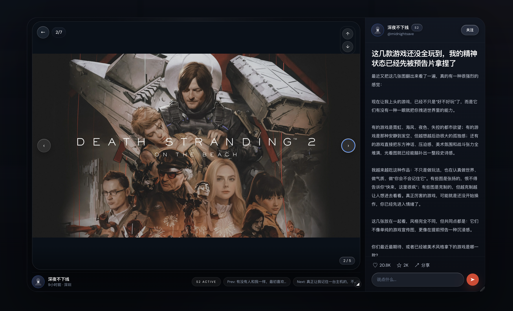
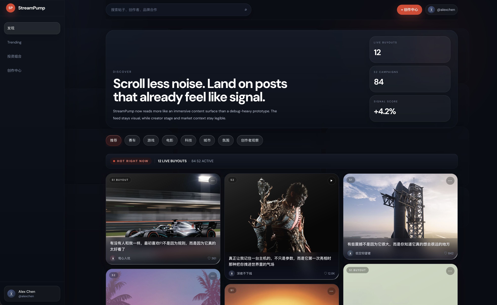
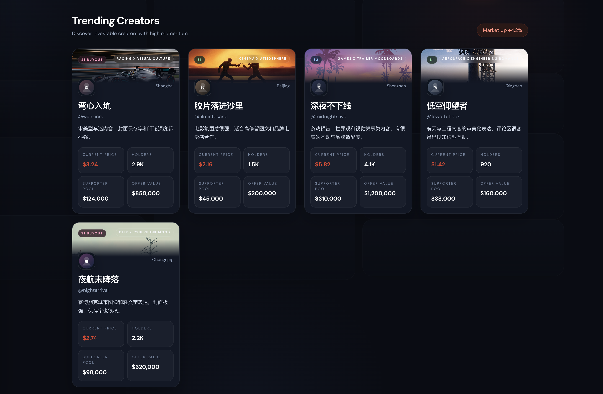
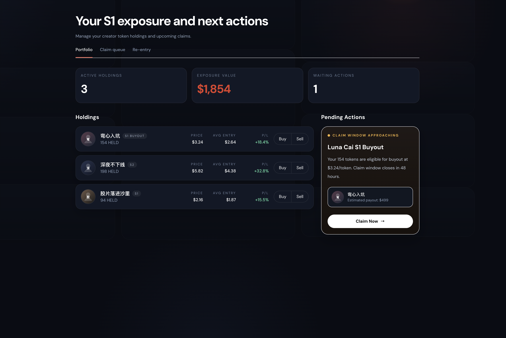
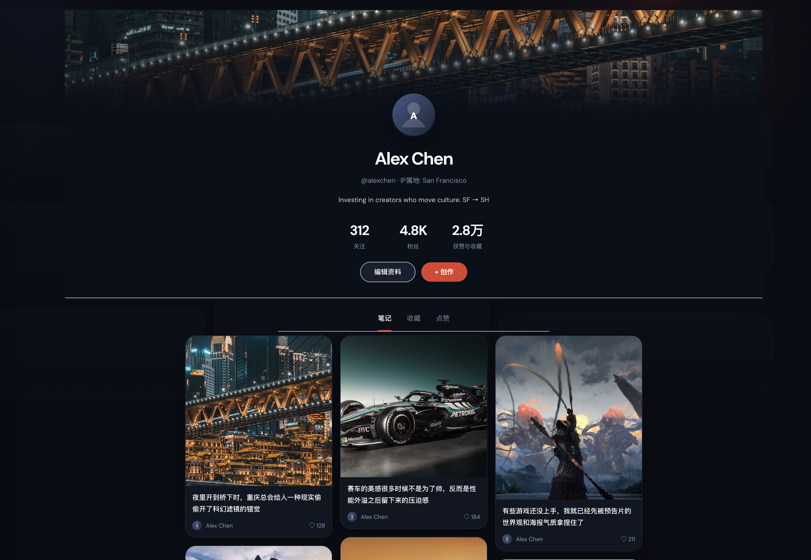

# StreamPump

**A creator sponsorship market for the short-video era.**

Short version: creators make content, sponsors bring USDC, fans bring conviction, and StreamPump keeps score.

StreamPump is building a Web2.5 creator economy stack:

- creators package content and campaign terms
- sponsors fund campaigns with real budgets
- fans can back creator momentum with protocol-native participation
- the final money movement settles on Solana

It is not "just another token app", and it is not "just another influencer CRM" either.  
The idea is to turn creator growth into something that can be funded, measured, and settled in a much clearer way.

## Why This Exists

The creator economy has a weird problem:

- creators create attention
- brands spend money
- fans create momentum
- platforms take the data

But the actual market between these four parties is still fragmented, opaque, and slow.

StreamPump is our attempt to fix that by combining:

- Web2 speed for high-frequency product actions
- on-chain settlement for high-value financial actions
- a product model designed for creators, sponsors, fans, and eventually MCNs

## The Product, in Human Language

Think of StreamPump as two connected products.

### Season 1: Creator Discovery Market

This is the "I think this creator is going somewhere" layer.

- fans use `SPUMP` to back a creator early
- creator momentum is tracked inside the protocol
- sponsors can make buyout-style offers
- once a creator graduates, they move into the sponsorship market

If S1 is the discovery layer, S2 is where real business starts.

### Season 2: Sponsored Campaign Market

This is the "brand budget meets creator performance" layer.

One proposal can include three budget tracks:

1. `Track 1`: fixed base pay for the creator
2. `Track 2`: performance-based budget tied to metrics like views, clicks, or saves
3. `Track 3`: delayed CPS-style payout after the return window closes

In plain English:

- sponsors fund a campaign once
- creators deliver the content
- the protocol later settles what should go to creator, sponsor, and fan incentive pool

### SPUMP

`SPUMP` is the protocol participation token.

It is intentionally designed as a **non-transferable Token-2022 asset**:

- it is not meant to be dumped on a DEX
- it is used inside the product, not traded outside it
- users spend it to participate
- the protocol can mint or burn it through approved contract paths

The current direction is closer to "fuel + reputation-linked participation" than "speculative asset".

## What Makes StreamPump Different

Most creator tools do one piece of the puzzle:

- analytics dashboards
- influencer CRM
- affiliate systems
- fan token experiments

StreamPump is trying to connect the whole loop:

1. discover a creator early
2. package content and campaign terms
3. fund the campaign
4. verify the outcome
5. settle the money clearly

That is why this repo has both on-chain code and a backend.  
The product is intentionally hybrid.

## Web2.5 by Design

We are not forcing every click and every draft onto Solana.

The current architecture principle is:

- **DB-first for fast product actions**  
  drafts, content manifests, uploads, click streams, queueing, and workflow state

- **Chain-first for financial truth**  
  sponsor funding, proposal creation, final settlement, refunds, and token mint/burn paths

This gives us a more realistic UX:

- less wallet pop-up spam
- lower RPC overhead
- cleaner final settlement guarantees

## Current Project Status

This repo is **not a polished production app yet**. It is a serious prototype moving toward a usable product.

### Already in place

- Anchor program for the core protocol
- S1 and S2 state machine logic
- non-transferable `SPUMP` mint checks
- content hash / content anchor support on-chain
- sponsor time-lock improvements for buyout offers
- Track 2 sweep and automatic-settlement primitives
- user profile and organization role primitives on-chain
- backend data model upgrade to `ContentManifest + ProposalIntent + TxBundle`
- backend `v1` routes for the new launch flow
- real Phase 1 launch bundle assembly with creator approval separated from external rent payment
- wallet challenge/signature auth with Bearer sessions for `v1` content and proposal launch routes
- bundle expiry rebuild and retry-safe launch submission recovery
- real local media flow verified across `Neon + AWS S3 + Mux`
- real Mux webhook delivery verified in local development via `Cloudflare Tunnel`
- Mux reconciliation worker for missed-webhook recovery
- explicit on-chain events emitted for proposal lifecycle, content anchoring, S1 buyout lifecycle, endorsement settlement, and user registration
- EventParser-first chain indexer with persisted `ChainEvent` records and proposal projection sync
- a much stronger frontend experience prototype built on the existing `pages` router
- immersive `Discover` feed with animated background, progressive image loading, and unified glassmorphism system
- refined `Trending`, `Portfolio`, `Profile`, `Login`, and `Activity` surfaces with a more coherent visual language
- dual-state login surface covering both first-time entry and account switching
- real wallet challenge/signature login from the tracked frontend login page
- supporter-facing `Portfolio` with exposure curve, row-level sparklines, claim queue, and re-entry prototype flows
- new follow-first `Activity` page with `综合 / 视频` tabs, creator filtering, and bilibili-inspired subscription-feed information architecture
- floating post-detail modal for both image and video posts with wheel-based post switching and preserved resize state

### Still under construction

- full backend task engine for daily SPUMP rewards and quests
- dispute / review workflow
- remaining explicit event coverage for the rest of the protocol surface
- real operator dashboards for creator, sponsor, MCN
- full frontend-to-backend wiring beyond mock-data-driven product surfaces
- real production media playback and final mobile interaction polish

### Important reality check

The frontend is no longer "just a scaffold", but it is still not a production-ready app.

Right now the strongest parts of the project are:

- protocol logic
- settlement design
- backend architecture direction
- the high-fidelity frontend interaction model

The main frontend gap now is not visual quality, but real data wiring and production hardening.

## Frontend Progress Update

The frontend moved forward substantially in the latest iteration.

What is now in place:

- a unified visual system across `Discover`, `Activity`, `Trending`, `Portfolio`, `Profile`, login, workspace pages, and post detail
- startup-only branded loading, with progressive blur-up media loading for large images instead of repeated full-page loaders
- an animated background layer so the app surface feels alive even behind floating detail views
- a floating post-detail modal with shared navigation for image and video posts, vertical wheel switching, lighter separators, and preserved resize state
- a dual-state login surface for first-time access and account switching previews
- a supporter portfolio flow with trend charts, claim queue, and re-entry action prototypes
- a follow-first activity feed with creator filtering, mixed post/update cards, and compact video-grid mode

What is still intentionally prototype-grade:

- most pages are still driven by local mock data
- video posts currently use poster-style presentation rather than a final production playback stack
- the UI has not yet been fully connected to the new backend content / proposal-intent flow
- social/provider login still uses preview identities through `provider-exchange`, even though external wallet login now uses the real challenge/signature path

## UI Snapshot

These screenshots reflect the current frontend direction inside the repo.

### Discover Feed

The main feed now behaves more like an immersive content surface than a static mockup. It uses a stronger poster-style hero, stage-aware post cards, and a subtle animated page layer in the background.



### Activity Feed

The new `Activity` surface adds a follow-first subscription layer inspired by bilibili-style dynamics. It introduces a left-side followed-creator rail, a central `综合 / 视频` content switcher, and a lighter right-side highlight column without breaking StreamPump's existing visual language.

### Floating Post Detail

Post detail is now a floating modal-style surface instead of a full hard transition page. Image and video posts share the same navigation model, and users can switch posts with the mouse wheel while keeping the resized modal state.



### Trending Creators

The `Trending` surface now reads like a creator market dashboard rather than a placeholder list, with clearer stage language, hero imagery, and creator-level market metrics.



### Portfolio

The `Portfolio` view now frames S1 exposure, pending claims, and action queues in a way that is much closer to an actual product surface for supporters.



### User Profile

The profile page now better matches the rest of the app, combining creator-style note cards, a stronger hero treatment, and a more coherent social / ownership surface.



## The New Backend Flow

We recently moved the backend design toward a more practical content-and-launch workflow.

### Content side

Instead of treating everything as a single uploaded video, the backend now models:

- `ContentManifest`
- `ContentAsset`
- `ContentPublication`

This is important because the target content format is closer to Xiaohongshu:

- short video
- image carousel
- mixed-media note
- text + media together

### Proposal side

Instead of creating a chain-facing proposal draft too early, the backend now separates:

- `ProposalIntent`: the off-chain business draft
- `TxBundle`: the launch transaction wrapper
- `Proposal`: the confirmed on-chain projection

That split is much closer to how the product really works.

The current Phase 1 launch path already supports:

- a real `VersionedTransaction`
- creator signature as business approval
- sponsor or external payer covering rent and transaction fee
- atomic proposal creation plus sponsor funding
- bundle reuse while active, bundle rebuild after expiry, and retry-safe submission keyed by the same signed transaction

The current backend auth path supports:

- `POST /api/v1/auth/challenge`
- `POST /api/v1/auth/verify`
- Bearer session auth on `v1/content/*` and `v1/proposal-intents/*`
- optional legacy `x-wallet-address` fallback only when explicitly enabled in local env

The current tracked frontend auth path supports:

- social/provider preview login through `POST /api/v1/auth/provider-exchange`
- real external-wallet login through `POST /api/v1/auth/challenge -> POST /api/v1/auth/verify`
- Bearer session storage in browser local state for `workspace`, `content`, `proposal-intents`, and proposal detail pages

## Who This Product Is For

### Regular users / fans

"I want to discover interesting creators early and participate in their growth."

### Creators

"I want money, distribution, and sponsor demand before I become huge."

### Sponsors / brands

"I want creator marketing that is measurable, auditable, and less fake."

### MCNs

"I want to manage multiple creators, multiple campaigns, and multiple sponsor relationships in one system."

## Monorepo Layout

```text
programs/streampump-core     Anchor program (Rust)
programs/tests               Anchor TypeScript tests
backend/                     API, storage, manifest flow, proposal-intent flow
app/                         Next.js product prototype for discover, activity, portfolio, profile, and workspace UX
docs/                        Architecture notes and backend contracts
scripts/                     Local helpers
```

## Quick Start

### On-chain program

```bash
anchor build
anchor test
```

### Backend

```bash
cd backend
npm install
npm run prisma:generate
npm run build
npm run dev
```

Install local Git safety hooks:

```bash
./scripts/install-git-hooks.sh
```

Recommended local secret flow:

```bash
cp backend/.env.example backend/.env.local
```

Then fill real values into `backend/.env.local` only.

Local video smoke test:

```bash
cd backend
node scripts/muxVideoSmokeTest.js ../test_files/test_mux.mp4
```

Direct Mux asset inspection:

```bash
cd backend
node scripts/muxAssetStatus.js <muxAssetId>
```

For local Mux webhook testing, the most reliable path we have verified is:

1. run the backend on `:4000`
2. expose it with Cloudflare Tunnel
3. register the tunnel URL as a real Mux webhook endpoint
4. use that endpoint secret as `MUX_WEBHOOK_SECRET`

Quick Tunnel example:

```bash
cloudflared tunnel --url http://127.0.0.1:4000
```

Git safety notes:

- `backend/.env.local` and other `.env.*` files are ignored by Git
- `.env.example` is the only env template that should be committed
- `pre-commit` checks staged files and blocks secret files or obvious credentials
- `pre-push` re-checks the current `HEAD` as a second safety net
- hooks are local Git config, so each new clone should run `./scripts/install-git-hooks.sh` once
- if a secret file was already tracked before ignore rules were added, run `git rm --cached <file>`

The shared hook logic lives in `scripts/git-hooks/secret-guard.sh`.
It currently blocks common secret paths such as `.env`, `.env.*`, `*.pem`, `id.json`, wallet keypair JSON files,
and scans file contents for connection strings with embedded credentials, secret-looking env assignments,
and private key blocks.

Useful env vars:

- `DATABASE_URL`
- `DIRECT_URL`
- `PORT`
- `API_BASE_URL`
- `SOLANA_RPC_ENDPOINT`
- `NEXT_PUBLIC_BACKEND_BASE_URL`
- `NEXT_PUBLIC_API_BASE_URL`
- `NEXT_PUBLIC_RPC_ENDPOINT`
- `NEXT_PUBLIC_WEB3AUTH_CLIENT_ID`
- `STREAMPUMP_PROGRAM_ID`
- `S3_*`
- `R2_*`
- `MUX_*`

### Frontend

```bash
cd app
npm install
npm run dev
```

Recommended local frontend env flow:

```bash
cp app/.env.example app/.env.local
```

Then fill at least:

- `NEXT_PUBLIC_BACKEND_BASE_URL=http://localhost:4000`
- `NEXT_PUBLIC_RPC_ENDPOINT=https://api.devnet.solana.com`
- `NEXT_PUBLIC_WEB3AUTH_CLIENT_ID=...` only if you want Web3Auth social login enabled

Notes:

- the frontend now prefers `NEXT_PUBLIC_BACKEND_BASE_URL` and derives `/api/v1` automatically
- `NEXT_PUBLIC_API_BASE_URL` is still accepted as a backward-compatible fallback
- wallet login on `/login` requires a Solana wallet that supports `signMessage`

## Recommended Reading

If you want the product and backend direction first, read:

- [docs/backend/prisma-migration-content-manifest.md](docs/backend/prisma-migration-content-manifest.md)
- [docs/backend/proposal-launch-api-contract.md](docs/backend/proposal-launch-api-contract.md)

## Where We Are Heading

The short-term goal is not "launch a giant SocialFi universe".

The short-term goal is much more practical:

- make creator content packaging clean
- make sponsor launch flow smooth
- make settlement trustworthy
- make the product understandable to normal users

If we get those four things right, the rest becomes much easier.

## License

This repository uses a dual-license structure:

- **On-chain programs** (`programs/`) are licensed under the [Apache License 2.0](programs/LICENSE).
- **Backend, frontend, scripts, and documentation** are licensed under the [Business Source License 1.1](LICENSE).

The BSL grants free use for personal learning, testnet experimentation, academic research, and contributions back to this project. Commercial use requires a separate license from the Licensor. On **April 20, 2030**, all BSL-covered code will automatically convert to Apache License 2.0.
