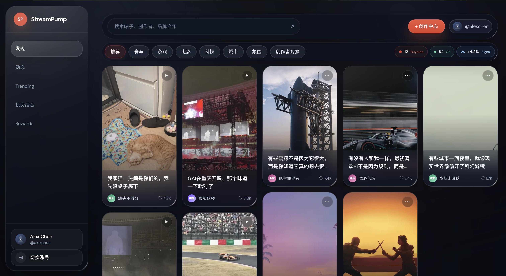

# StreamPump

<div align="center">
  <p><strong>A Web2.5 creator sponsorship market where content, creator momentum, sponsor budgets, fan participation, and Solana settlement live in one product loop.</strong></p>
  <p>一句话：StreamPump 不是单纯的 fan token，也不是传统 influencer CRM；它把内容创作、赞助预算、粉丝参与、链上结算放进同一个产品流程。</p>
  <p>
    <a href="#current-status">Status</a> ·
    <a href="#product-model">Product Model</a> ·
    <a href="#architecture">Architecture</a> ·
    <a href="#local-setup">Local Setup</a> ·
    <a href="#demo-path">Demo Path</a>
  </p>
  
</div>

## Current Status

StreamPump is a serious prototype moving toward a usable product. The strongest path today is the **S2 sponsored campaign launch and settlement spine**. The **public creator discovery frontend** is visually advanced, but several actions still need production wiring.

Snapshot as of **2026-05-08**:

| Layer | Progress | What is real now | Main gaps |
| --- | --- | --- | --- |
| Solana program | Advanced prototype | Anchor instructions for S1 discovery, S1 buyout, S2 proposal creation, sponsor funding, campaign settlement, content hash anchoring, protocol/user/org state | Not audited; some Tier 2 surfaces are not ready for public frontend exposure |
| Backend | Integration prototype | Express v1 API, Prisma read/write models, auth/session shell, content manifests, proposal intents, transaction bundles, public feed, market projections, Cloudflare R2 storage, Mux, indexer/reconciliation services | Production identity verification, operator tooling, full media/review workflows, deployment hardening |
| Frontend | Product shell plus partial API wiring | Next.js user surface for Explore, Trending, Creator, Post, Portfolio, Me, Activity; workspace and campaign pages; wallet/Web3Auth scaffolding | Some S1 market, rewards, buyout, settlement, and workspace actions remain preview or read-only |
| Demo readiness | Scoped | `wallet sign-in -> content manifest -> proposal intent -> creator sign -> sponsor sign -> confirmed Solana campaign` | S1 buy/sell/claim must be presented as product vision unless promoted later |
| Deployment | Planned | Vercel app + Render backend + Neon/Postgres + Cloudflare R2 + Mux documented | No verified checked-in Vercel project config from repo root |

## Product Model

StreamPump has two connected product layers.

### Season 1: Creator Discovery Market

Fans use non-transferable `SPUMP` to back creators early. `SPUMP` is burned into creator-specific virtual S1 positions priced by a rating-adjusted bonding curve. Creator momentum is tracked by the protocol, and sponsors can make buyout-style offers before a creator graduates into the sponsorship market.

S1 is not a freely transferable fan-token market. Users burn `SPUMP` to receive an internal creator position recorded in `S1UserPosition`; no creator SPL token is minted.

```text
effective_k = base_k * creator_rating_bps / 10_000
buy cost = effective_k / 2 * ((S + dS)^2 - S^2)
sell return = effective_k / 2 * (S^2 - (S - dS)^2)
```

Default rating is `10_000` (1.0x), bounded between `5_000` and `20_000` (0.5x-2.0x), with daily change caps and delayed effectiveness. Participation is guarded by registered profiles, activity scores, daily buy caps, and capped early-cohort buyout claims.

See [docs/protocol/s1-market-design.md](docs/protocol/s1-market-design.md) for the current parameter rationale and anti-arbitrage guardrails.

### Season 2: Sponsored Campaign Market

Sponsors fund creator campaigns with three budget tracks:

| Track | Purpose |
| --- | --- |
| Track 1 | Fixed creator base pay |
| Track 2 | Performance budget tied to verified metrics |
| Track 3 | Delayed CPS-style payout after the return window closes |

The intended S2 launch experience is DB-first until money must move, then chain-first for final truth:

```text
wallet session
  -> content manifest
  -> proposal intent
  -> creator partial signature
  -> sponsor final signature
  -> Solana proposal + funded vault
  -> campaign settlement
```

## Architecture

The repo is intentionally hybrid:

- **DB-first for product workflow**: drafts, content manifests, uploads, media processing, proposal intents, retries, and workspace state.
- **Chain-first for financial truth**: sponsor funding, proposal creation, settlement, refunds, token mint/burn paths, and immutable content anchors.

```mermaid
flowchart LR
  Creator["Creator / Sponsor / Fan"] --> App["Next.js app"]
  App --> API["Express v1 API"]
  API --> DB["Postgres / Prisma"]
  API --> Storage["Cloudflare R2 object storage"]
  API --> Mux["Mux video processing"]
  API --> Indexer["Indexer + reconciliation jobs"]
  API --> Solana["Solana / Anchor program"]
  Oracle["Oracle / operator flows"] --> API
  Oracle --> Solana
  Solana --> Indexer
  Indexer --> DB
```



## What Is In This Repo

| Path | Role |
| --- | --- |
| `programs/streampump-core` | Anchor program for protocol state, S1, S1 buyout, and S2 settlement |
| `programs/tests` | Anchor TypeScript tests for happy paths, unhappy paths, guards, buyout, and S2 flows |
| `backend` | Express API, Prisma schema, storage, Mux, auth, indexer, schedulers, and market projections |
| `app` | Next.js frontend for user discovery, creator pages, portfolio, workspace, campaign, and auth surfaces |
| `docs` | Protocol notes, frontend design docs, backend API contracts, deployment notes, progress reviews |
| `local-post-assets` | Local seed content used for development feeds and media smoke tests |
| `scripts` | Local helper scripts, demo scripts, cover generation, and git hooks |
| `third_party` | Vendored Rust dependencies used by the Anchor workspace |

## Frontend Surface

The current user surface is designed as a social product first, not a trading terminal. The goal is to make creator momentum legible through content, profiles, comments, portfolios, and lightweight market status.

Implemented or scaffolded routes include:

```text
/explore
/trending
/posts/[postId]
/creators/[creatorId]
/market/[creatorId]
/buyout/[creatorId]
/portfolio
/activity
/rewards
/me
/login
/workspace
/workspace/content/new
/workspace/content/[manifestId]
/workspace/intents/[intentId]
/workspace/buyout
/campaigns/[proposalId]
/campaigns/[proposalId]/endorse
/campaigns/[proposalId]/settlement
```

Design notes live in:

- [docs/frontend/design.md](docs/frontend/design.md)
- [docs/frontend/user-surface-ui-spec.md](docs/frontend/user-surface-ui-spec.md)
- [docs/frontend/phase1-frontend-development-plan.md](docs/frontend/phase1-frontend-development-plan.md)

## Local Setup

Prerequisites:

- Node.js 20+
- npm
- Rust toolchain
- Solana CLI and Anchor for on-chain tests
- Postgres for backend integration work

Install dependencies:

```bash
npm install
npm install --prefix app
npm install --prefix backend
```

Create local env files:

```bash
cp app/.env.example app/.env.local
cp backend/.env.example backend/.env.local
```

Fill real secrets only in `.env.local`. Env files are ignored by Git.

### Frontend

```bash
cd app
npm run dev
```

Important frontend env vars:

```text
NEXT_PUBLIC_BACKEND_BASE_URL=http://localhost:4000
NEXT_PUBLIC_RPC_ENDPOINT=https://api.devnet.solana.com
NEXT_IMAGE_REMOTE_HOSTS=pub-b0acd300bcec4dc5ba5ea36628dd809f.r2.dev
NEXT_PUBLIC_WEB3AUTH_CLIENT_ID=...
```

The frontend prefers `NEXT_PUBLIC_BACKEND_BASE_URL` and derives `/api/v1` automatically. `NEXT_PUBLIC_API_BASE_URL` is still accepted as a backward-compatible fallback.

### Backend

```bash
cd backend
npm run prisma:generate
npm run build
npm run dev
```

Common backend env vars:

```text
DATABASE_URL
DIRECT_URL
PORT
API_BASE_URL
CORS_ALLOWED_ORIGINS
AUTH_SESSION_SECRET
SOLANA_RPC_ENDPOINT
STREAMPUMP_PROGRAM_ID
R2_REGION
R2_BUCKET
R2_ENDPOINT
R2_ACCESS_KEY_ID
R2_SECRET_ACCESS_KEY
R2_PUBLIC_BASE_URL
R2_MAX_ASSET_SIZE_BYTES
R2_MONTHLY_UPLOAD_LIMIT_BYTES
MUX_*
```

The backend uses the AWS S3 SDK for S3-compatible requests, but the intended object storage provider is **Cloudflare R2**. Existing deployments may still use `S3_*` aliases pointed at R2; if both are present and non-empty, `S3_*` takes precedence for compatibility.

S1 action transactions are exposed under `/api/v1/s1/*/build`. These endpoints return unsigned or backend-partially-signed v0 transactions for client wallet signing, plus derived PDA metadata and `requiredSigners`. Submit signed transactions through `POST /api/v1/s1/transactions/submit` and poll `GET /api/v1/s1/transactions/:signature/status`.

R2 usage guardrails:

- Keep `R2_MAX_ASSET_SIZE_BYTES=104857600` for a 100MiB per-asset upload cap unless you intentionally support larger videos.
- Set `R2_MONTHLY_UPLOAD_LIMIT_BYTES=10737418240` for a 10GiB backend-side monthly upload budget. Set it to `0` only when you intentionally disable this hard limit.
- Keep public feed reads on a cacheable R2 custom domain where possible; use signed read URLs only as a temporary fallback because every signed `GetObject` still counts as an R2 read operation.
- Prefer standard R2 storage for frequently accessed media. Infrequent Access can reduce storage cost, but reads add retrieval fees and objects have a 30-day minimum storage duration.

Local media smoke test:

```bash
cd backend
node scripts/muxVideoSmokeTest.js ../test_files/test_mux.mp4
```

Direct Mux asset inspection:

```bash
cd backend
node scripts/muxAssetStatus.js <muxAssetId>
```

For local Mux webhook testing, run the backend on `:4000`, expose it with Cloudflare Tunnel, register the tunnel URL in Mux, and use that endpoint secret as `MUX_WEBHOOK_SECRET`.

```bash
cloudflared tunnel --url http://127.0.0.1:4000
```

### On-chain Program

```bash
npm run build:anchor
anchor test
```

`npm run build:anchor` keeps Cargo/Anchor artifacts in `/private/tmp/streampump-anchor-target` by default. This avoids macOS Desktop/iCloud file-provider stalls that can leave `anchor build` hanging in the repository `target/` directory. Override `CARGO_TARGET_DIR` if you need a different local cache path.

For a lighter Rust check:

```bash
cargo check
```

## Test Commands

```bash
npm run build --prefix app
npm run build --prefix backend
cargo check
npm run test:backend
npm run test:anchor
```

Useful focused commands:

```bash
npm run test:s1:happy
npm run test:s1:unhappy
npm run test:s1:buyout
npm run test:s1:buyout:unhappy
npm run test:s2:unhappy
```

## Demo Path

For the current hackathon/demo build, keep the live path intentionally scoped to S2:

```text
wallet sign-in
  -> content manifest
  -> proposal intent
  -> creator signs launch bundle once
  -> sponsor signs and submits once
  -> confirmed Solana campaign
  -> campaign detail shows PDA, tx signature, manifest hash, content anchor
```

Use [DEMO.md](DEMO.md) for the exact runbook, required env toggles, seed scripts, devnet smoke data, and acceptance checklist.

Important boundary: S1 discovery, portfolio, buyout, and claim screens are currently read-model/product-vision previews unless explicitly promoted later.

## Deployment Notes

Recommended first deployment path:

| Surface | Target |
| --- | --- |
| Frontend | Vercel with root directory `app` |
| Backend | Render with root directory `backend` |
| Database | Neon/Postgres |
| Object storage | Cloudflare R2 |
| Video | Mux |

For Vercel:

- Root Directory: `app`
- Build Command: `next build`
- Required env vars: `NEXT_PUBLIC_BACKEND_BASE_URL`, `NEXT_PUBLIC_RPC_ENDPOINT`, `NEXT_IMAGE_REMOTE_HOSTS`
- Optional env var: `NEXT_PUBLIC_WEB3AUTH_CLIENT_ID`

For Render:

```bash
npm ci --include=dev && npm run prisma:generate && npm run build
```

Start command:

```bash
npm run start
```

Run production migrations against the production database:

```bash
cd backend
npm run prisma:migrate:deploy
```

More details live in [docs/backend/vercel-render-deployment.md](docs/backend/vercel-render-deployment.md).

## Roadmap

Near-term priorities:

- Finish production auth identity verification and session hardening.
- Wire workspace upload/finalize/publication actions end to end.
- Promote selected S1 market read models into real frontend actions only after backend and chain projections are ready.
- Complete production media playback, mobile polish, and Mux reconciliation visibility.
- Add operator dashboards for oracle, fraud review, reconciliation, and settlement monitoring.
- Verify deployment from clean Vercel/Render projects and document environment ownership.
- Run broader security review before any real-money deployment.

## Documentation Index

- [DEMO.md](DEMO.md): scoped S2 demo runbook.
- [docs/protocol/s1-market-design.md](docs/protocol/s1-market-design.md): S1 economics and guardrails.
- [docs/backend/proposal-launch-api-contract.md](docs/backend/proposal-launch-api-contract.md): DB-first launch contract.
- [docs/backend/env-and-vendor-guide.md](docs/backend/env-and-vendor-guide.md): backend environment and vendor setup.
- [docs/backend/aws-media-access-runbook.md](docs/backend/aws-media-access-runbook.md): media storage operations.
- [docs/backend/vercel-render-deployment.md](docs/backend/vercel-render-deployment.md): deployment notes.
- [docs/progress-review-2026-04.md](docs/progress-review-2026-04.md): previous progress review.

## Git Safety

Install local hooks:

```bash
./scripts/install-git-hooks.sh
```

The hook blocks common secret patterns before commit. Keep real credentials out of `.env.example`, docs, screenshots, and demo logs.

## License

This repository uses a dual-license structure:

- On-chain programs under `programs/` are licensed under the [Apache License 2.0](programs/LICENSE).
- Backend, frontend, scripts, and documentation are licensed under the [Business Source License 1.1](LICENSE).

The BSL allows personal learning, testnet experimentation, academic research, and contributions back to this project. Commercial use requires a separate license from the Licensor. On April 20, 2030, all BSL-covered code automatically converts to Apache License 2.0.
