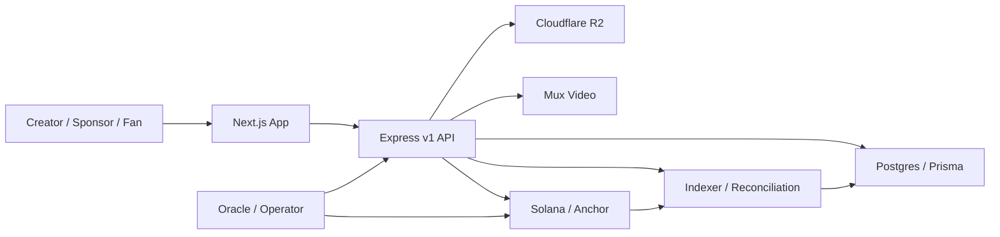

<p align="center">
  <h1 align="center">🎬 StreamPump</h1>
  <p align="center">
    <strong>The Web2.5 trust layer for creator sponsorship — where content, creator momentum, fan participation, and sponsor budgets settle on Solana in one product loop.</strong>
  </p>
  <p align="center">
    
    
    
    
    
  </p>
  <p align="center">
    <a href="README.zh-CN.md">🇨🇳 中文版 README</a>
  </p>
  
</p>

---

## 📋 Table of Contents

- [What Is This?](#-what-is-this)
- [Why StreamPump Is Different](#-why-streampump-is-different)
- [Features](#-features)
- [Screenshots](#-screenshots)
- [Product Model](#-product-model)
- [How It Works](#-how-it-works)
- [Why Solana](#-why-solana)
- [Current Status](#-current-status)
- [Repository Layout](#-repository-layout)
- [Quick Start](#-quick-start)
- [Tech Stack](#-tech-stack)
- [Demo Path](#-demo-path)
- [Testing](#-testing)
- [Deployment](#-deployment)
- [Roadmap](#-roadmap)
- [Documentation Index](#-documentation-index)
- [Security & Git Safety](#-security--git-safety)
- [License](#-license)

---

## ✨ What Is This?

**StreamPump** is a Web2.5 creator sponsorship market built on Solana. It places content creation, creator momentum, sponsor budgets, fan participation, and on-chain settlement into a single product loop.

It is **not** a fan-token casino, **not** an influencer CRM, and **not** a view-to-earn reward farm. It is the **trust layer** between three groups who currently lack one:

- **Creators** get cold-start funding from fans, then graduate into structured sponsorship deals with guaranteed base pay *and* performance upside.
- **Fans / backers** support creators early with non-transferable `SPUMP`, and earn real **USDC** when a sponsor buys out a creator they believed in — not from secondary-market speculation.
- **Sponsors** reach creators directly (no agency middlemen) through three flexible USDC budget tracks, and receive verifiable on-chain campaign proof.

```text
content → creator momentum → fan participation → sponsor USDC budget → Solana settlement
```

> **Design principle:** DB-first for product workflow, chain-first for financial truth. Drafts, uploads, manifests, and intents live in Postgres; funding, settlement, and token movement are Solana truth.

---

## 🔥 Why StreamPump Is Different

The creator economy is projected to reach **$480B by 2027** (Goldman Sachs), with **$37B** in US creator ad spend (IAB 2025), and **73%** of brands now prefer micro and mid-tier creators over mega-influencers. The demand is here — **the missing layer is trust.**

Web3 has tried to capture this and mostly failed, for structural reasons:

| Project | What happened |
|---|---|
| **Friend.tech** | ~80k DAU → **<10k**; revenue collapsed to **$71**; contract abandoned |
| **Farcaster** | Raised **$150M**; signups dropped **15k/mo → 545/mo** |
| **Lens Protocol** | New users **37k/mo → 142/mo** — a **99.6%** collapse |

Three structural failures killed them: **token-first instead of product-first**, **view-to-earn death spirals** (earn token → dump on DEX → price crashes → users leave), and **fake content ownership** nobody actually wanted.

StreamPump is built on four convictions that avoid every one of these traps:

| Conviction | What it means |
|---|---|
| 🎥 **Content is the asset** | Videos and posts retain audiences — meme coins and NFTs only attract speculators. We don't claim to own or tokenize content; the chain holds a creator-signed publication timestamp + attribution that routes revenue, while content stays on the creator's own platforms |
| 🔒 **`SPUMP` is utility-only** | Non-transferable Token-2022; never listed on DEX/CEX. Backing is skin in the game **priced in time and attention, not money** — non-transferability is the mechanism that makes it a credible conviction signal, not a compromise |
| 💼 **Sponsors are marketing spenders** | Campaign budgets, not speculative capital — a far healthier funding source |
| ⚙️ **Automated by design** | No bloated team or extractive tokenomics; service fees + small USDC tx fees keep the lights on |

---

## 🎯 Features

| Feature | Description |
|---|---|
| 🚀 **S1 Creator Discovery** | Fans burn `SPUMP` into rating-adjusted bonding-curve positions to back creators early |
| 🤝 **S1 → S2 Buyout Bridge** | Sponsors bid USDC to buy out a creator; backers rage-quit or claim a pro-rata share at graduation |
| 📊 **Three-Track Sponsorship** | Fixed base pay, performance budget, and delayed CPS — all settled per track on-chain |
| 🗳️ **Fan Endorsement Pool** | Fans burn `SPUMP` to endorse campaigns and earn pro-rata USDC from the Track 2 performance pool |
| 🔗 **Verifiable Campaign Proof** | Every campaign exposes its PDA, tx signature, manifest hash, and content anchor |
| 👛 **Web2.5 Managed Wallets** | Email/social users get a platform-custodied wallet — backend signs and pays, zero SOL required |
| 🛡️ **Anti-Speculation Guardrails** | Non-transferable token, daily buy caps, dynamic exit tax, delayed ratings, endorsement caps |
| 🎞️ **Real Media Pipeline** | Cloudflare R2 storage + Mux video processing + publication verification before public feed |

---

## 📸 Screenshots

| Discover | Trending Creators |
|---|---|
|  |  |

| Portfolio | Post Detail |
|---|---|
|  |  |

---

## 🧩 Product Model

StreamPump has two connected product layers.

### Season 1 — Creator Discovery Market

S1 is the discovery layer where early creators bootstrap commercial value. A fan burns `SPUMP` (non-transferable Token-2022) and receives an **internal creator position** recorded as a PDA in `S1UserPosition` — *not* a tradable SPL token. Price moves along a quadratic bonding curve scaled by an oracle-evaluated momentum rating:

```text
effective_k = base_k * creator_rating_bps / 10_000
buy cost    = effective_k / 2 * ((S + dS)^2 - S^2)
sell return = effective_k / 2 * (S^2 - (S - dS)^2)
```

Default rating is `10_000` (1.0×), bounded `5_000`–`20_000` (0.5×–2.0×), with daily change caps and delayed activation. When a creator reaches critical mass, sponsors submit **buyout offers**; after creator acceptance and a rage-quit window, **graduation** executes and remaining backers claim their share of buyout USDC.

> See [docs/protocol/s1-market-design.md](docs/protocol/s1-market-design.md) for parameters and anti-arbitrage guardrails.

### Season 2 — Sponsored Campaign Market

Sponsors fund campaigns through three budget tracks:

| Track | Model | Settlement |
|---|---|---|
| **Track 1** | Fixed base pay | Unconditional creator payout |
| **Track 2** | Performance budget | Cliff threshold; above it, 80% creator / 20% fan endorsement pool |
| **Track 3** | CPS (cost per sale) | Delayed settlement after the refund window closes |

The launch experience is DB-first until money must move, then chain-first for final truth:

```text
wallet session
  → content manifest
  → proposal intent
  → creator partial signature
  → sponsor final signature
  → Solana proposal + funded vault
  → per-track settlement
```

### Loyalty & Fan Badges (design)

> 🧭 **Design / planned — not implemented yet.** Spec: [docs/protocol/fan-loyalty-and-spump-economy.md](docs/protocol/fan-loyalty-and-spump-economy.md).

A loyalty layer sits on top of S1/S2 to make early-fan status concrete and to give `SPUMP` always-available sinks. Each fan holds a per-creator **soulbound Fan Badge** that levels up from following duration plus engagement, with a permanent **Founding Backer #N** rank for early-cohort backers. `SPUMP` is positioned as conviction/voice — not money — so non-transferability is a feature: because it can only be earned over time, spending it is a credible signal of real conviction. Badge tier claims, cheers, content boosts, and perk unlocks burn `SPUMP`, decoupling its usefulness from "is there a creator worth backing right now," and per-creator S1 daily caps scale with badge tier so loyalty (not capital) earns backing priority.

---

## 🏗 How It Works



- **DB-first for workflow:** drafts, manifests, uploads, media processing, proposal intents, retries, workspace state.
- **Chain-first for truth:** sponsor funding, proposal creation, settlement, refunds, token mint/burn, immutable content anchors.

The Anchor program ships **32 type-safe instructions** and **13 PDA account types** covering the full lifecycle — S1 discovery, S1 buyout, S2 campaigns, three-track settlement, content anchoring, and protocol/user/org state.

---

## ⚡ Why Solana

Every core mechanism depends on a specific Solana capability — this is not a marketing choice:

| Capability | Why it matters |
|---|---|
| **~400ms finality** | S1 bonding-curve buy/sell must confirm instantly for usable UX |
| **Sub-cent fees** | Makes Track 2 micro-settlements and Track 3 CPS payouts economically viable |
| **Token-2022 NonTransferable** | Enforces `SPUMP` non-transferability at the protocol level, not by convention |
| **PDA architecture** | Config, profiles, S1 positions, proposals, and USDC vaults are deterministic, verifiable on-chain state |
| **Anchor framework** | 32 type-safe instructions for the entire product lifecycle in one program |
| **Ecosystem** | Wallet adapters, Web3Auth social login, mature RPC, and devnet for fast iteration |

---

## 📍 Current Status

StreamPump is a serious prototype with a **verified end-to-end production corridor** (authenticated creator → media upload → public feed → proposal → dual-signature launch → on-chain campaign proof). Several surfaces remain controlled-demo or operator-gated, and readiness labels are kept honest.

| Area | Readiness | What's real now |
|---|---|---|
| **Production corridor** | ✅ Verified E2E | Auth → R2/Mux media → feed → proposal intent → dual sign → Solana → campaign proof |
| **S1 market buy/sell** | `SEEDED_DEMO` | Live buy/sell against seeded devnet state with wallet session |
| **S1 portfolio / claim** | `SEEDED_DEMO` | Claim USDC from a graduated buyout position |
| **S1 buyout lifecycle** | `BACKEND_READY_UI_GAP` + `OPERATOR_REQUIRED` | Full chain + builder support; workspace UI still preview |
| **S2 proposal launch** | `SEEDED_DEMO` | Full corridor verified |
| **S2 endorsement** | `SEEDED_DEMO` + `BACKEND_READY_UI_GAP` | On-chain burn + backend build/submit for seeded proposals |
| **Settlement Track 1/2** | `OPERATOR_REQUIRED` | Operable against controlled data |
| **Settlement Track 3 (CPS)** | `MOCK_PREVIEW` + `OPERATOR_REQUIRED` | Gated — requires a real merchant/reconciliation provider |
| **Managed wallet signing** | In progress | Backend custodial signing path implemented; production needs KMS + program deploy |
| **Rewards** | `MOCK_PREVIEW` | Managed daily-claim path wired; missions still preview |
| **Operator tooling** | `OPERATOR_REQUIRED` | Internal routes exist; no dashboards yet |

> ⚠️ The Anchor program is **not audited**. Do not deploy with real funds. The new chain guards and reward behavior require program deployment before they are live on-chain.

### Compliance & token posture (design in progress)

`SPUMP` is a non-transferable utility/consumption unit with no monetary value and no expectation of profit. To keep backing a costly conviction signal **without** it being an investment contract, the backer USDC mechanism is being recharacterized from a *pro-rata share of the buyout* (which current on-chain code still implements) into a **capped, platform-funded discovery/loyalty reward that does not scale with `SPUMP` staked** — with permanent founding status, not USDC, as the headline reward. Public, real-money launch is gated on this redesign plus geofencing, KYC for USDC-receiving users, an Anchor audit, and a legal token-classification opinion. See [docs/protocol/spump-compliance-and-value-model.md](docs/protocol/spump-compliance-and-value-model.md). Until then, treat all USDC reward flows as demo/seeded only.

For the full picture see [docs/streamPump-long-term-roadmap.md](docs/streamPump-long-term-roadmap.md) (canonical roadmap + progress ledger) and [docs/product-readiness-phase-0.md](docs/product-readiness-phase-0.md).

---

## 📦 Repository Layout

| Path | Role |
|---|---|
| `programs/streampump-core` | Anchor program: protocol state, S1, S1 buyout, S2 three-track settlement, content anchoring |
| `programs/tests` | 10 Anchor TypeScript suites (happy/unhappy paths, guards, buyout, S2 flows) |
| `backend` | Express v1 API, Prisma (22 models / 17 migrations), R2/Mux, auth, indexer, schedulers, projections |
| `app` | Next.js 15 frontend: discovery, creator, portfolio, workspace, campaign, and auth surfaces |
| `docs` | Protocol design, backend API contracts, frontend specs, deployment notes, roadmap |
| `scripts` | Devnet seed, demo, smoke, deploy, and git-hook scripts |
| `local-post-assets` | Local seed media for dev feeds and media smoke tests |
| `third_party` | Vendored Rust dependencies for the Anchor workspace |

---

## 🚀 Quick Start

**Prerequisites:** Node.js 20+, npm, Rust toolchain, Solana CLI + Anchor (for on-chain tests), Postgres.

```bash
# Install dependencies (three separate targets — no monorepo tool)
npm install
npm install --prefix app
npm install --prefix backend

# Create local env files (fill secrets only in .env.local — Git-ignored)
cp app/.env.example app/.env.local
cp backend/.env.example backend/.env.local
```

### Frontend

```bash
cd app
npm run dev          # http://localhost:3000
```

Key env vars:

```text
NEXT_PUBLIC_BACKEND_BASE_URL=http://localhost:4000
NEXT_PUBLIC_RPC_ENDPOINT=https://api.devnet.solana.com
NEXT_IMAGE_REMOTE_HOSTS=pub-b0acd300bcec4dc5ba5ea36628dd809f.r2.dev
NEXT_PUBLIC_WEB3AUTH_CLIENT_ID=...
```

The frontend derives `/api/v1` from `NEXT_PUBLIC_BACKEND_BASE_URL` automatically.

### Backend

```bash
cd backend
npm run prisma:generate
npm run build
npm run dev          # http://localhost:4000
```

Common env vars: `DATABASE_URL`, `DIRECT_URL`, `AUTH_SESSION_SECRET`, `SOLANA_RPC_ENDPOINT`, `STREAMPUMP_PROGRAM_ID`, `R2_*`, `MUX_*`, `MANAGED_WALLET_ENCRYPTION_KEY`. See [docs/backend/env-and-vendor-guide.md](docs/backend/env-and-vendor-guide.md).

### On-chain Program

```bash
npm run build:anchor   # artifacts go to /private/tmp to avoid macOS file-provider stalls
anchor test
cargo check            # lighter type check
```

---

## 🛠 Tech Stack

| Layer | Technology |
|---|---|
| **Solana program** | Rust + Anchor 0.32, Solana CLI 2.3.0, Token-2022 (NonTransferable mint) |
| **Backend** | Express 4, TypeScript 5, Prisma 6, PostgreSQL |
| **Frontend** | Next.js 15, React 18, Tailwind CSS 3, TypeScript 5 |
| **Object storage** | Cloudflare R2 (via AWS SDK S3 transport) |
| **Video** | Mux (upload, webhook, reconciliation, HLS) |
| **Auth** | Wallet adapters (Phantom, Solflare), Web3Auth, email OTP, wallet challenge |
| **Deployment** | Vercel (app), Render (backend), Neon (DB), Cloudflare R2, Mux |
| **Program ID** | `FYphzoVLs1MB7aqHbGeT2DjqwTz1d6yyhtKXzvmjiDmp` |

---

## 🎬 Demo Path

The live demo is intentionally scoped to two controlled flows:

```text
S1 controlled demo
  → seed devnet S1 market + graduated buyout
  → open /market/:creatorWallet → buy/sell S1 with wallet session
  → open /buyout/:creatorWallet → claim USDC from a seeded holder position
  → verify /portfolio read model

S2 campaign demo
  → wallet sign-in → content manifest → proposal intent
  → creator signs launch bundle once → sponsor signs and submits once
  → confirmed Solana campaign
  → campaign detail shows PDA, tx signature, manifest hash, content anchor, track state
```

See [DEMO.md](DEMO.md) for the exact runbook, env toggles, seed scripts, and acceptance checklist.

> **Boundary:** S1 buyout formation and S2 Track 3 reconciliation are operator/seed-prepared for the demo, not presented as live external integrations.

---

## 🧪 Testing

```bash
npm run build --prefix app
npm run build --prefix backend
cargo check
npm run test:backend        # 15 backend suites
npm run test:anchor         # 10 Anchor suites (requires local validator)
```

Focused suites:

```bash
npm run test:s1:happy
npm run test:s1:unhappy
npm run test:s1:buyout
npm run test:s1:buyout:unhappy
npm run test:s2:unhappy
```

---

## ☁️ Deployment

| Surface | Target |
|---|---|
| Frontend | Vercel (root directory `app`, build `next build`) |
| Backend | Render (root directory `backend`) |
| Database | Neon / Postgres |
| Object storage | Cloudflare R2 |
| Video | Mux |

Render build / start:

```bash
npm ci --include=dev && npm run prisma:generate && npm run build
npm run start
```

Apply production migrations:

```bash
cd backend && npm run prisma:migrate:deploy
```

Details in [docs/backend/vercel-render-deployment.md](docs/backend/vercel-render-deployment.md).

---

## 🗺 Roadmap

Near-term priorities:

- Harden the verified production corridor (auth → media → feed → proposal → campaign proof).
- Finish production auth identity verification and managed-wallet hardening (KMS/Vault, SOL budget, recovery).
- Productize the S1 buyout formation UI after the controlled S1 demo path stabilizes.
- Complete S2 endorsement claim UX and the fan reward ledger.
- Add operator dashboards for oracle, fraud review, reconciliation, and settlement monitoring.
- Build the loyalty/Fan Badge layer and `SPUMP` sinks (cheer, boost, tier claims) — see [docs/protocol/fan-loyalty-and-spump-economy.md](docs/protocol/fan-loyalty-and-spump-economy.md).
- Run a broader security review before any real-money deployment.

---

## 📚 Documentation Index

- [DEMO.md](DEMO.md) — controlled S1/S2 demo runbook
- [docs/streamPump-long-term-roadmap.md](docs/streamPump-long-term-roadmap.md) — canonical roadmap + progress ledger
- [docs/product-readiness-phase-0.md](docs/product-readiness-phase-0.md) — post-hackathon readiness boundary
- [docs/protocol/s1-market-design.md](docs/protocol/s1-market-design.md) — S1 economics and guardrails
- [docs/protocol/fan-loyalty-and-spump-economy.md](docs/protocol/fan-loyalty-and-spump-economy.md) — loyalty/Fan Badge layer and SPUMP sinks (design)
- [docs/protocol/spump-compliance-and-value-model.md](docs/protocol/spump-compliance-and-value-model.md) — securities posture and SPUMP value model (design)
- [docs/protocol/content-attribution-and-anchoring.md](docs/protocol/content-attribution-and-anchoring.md) — honest content anchor model: attribution, not ownership (design)
- [docs/backend/proposal-launch-api-contract.md](docs/backend/proposal-launch-api-contract.md) — DB-first launch contract
- [docs/backend/env-and-vendor-guide.md](docs/backend/env-and-vendor-guide.md) — backend environment and vendor setup
- [docs/frontend/design.md](docs/frontend/design.md) — frontend design system

---

## 🔒 Security & Git Safety

```bash
./scripts/install-git-hooks.sh   # blocks common secret patterns before commit
```

Keep real credentials out of `.env.example`, docs, screenshots, and demo logs. Managed-wallet secrets are encrypted (AES-256-GCM) and require `MANAGED_WALLET_ENCRYPTION_KEY` at runtime — never commit it.

---

## 📄 License

Dual-license structure:

- On-chain programs under `programs/` — [Apache License 2.0](programs/LICENSE)
- Backend, frontend, scripts, and docs — [Business Source License 1.1](LICENSE)

The BSL permits personal learning, testnet experimentation, academic research, and contributions back to this project. Commercial use requires a separate license. On **April 20, 2030**, all BSL-covered code automatically converts to Apache License 2.0.

---

<p align="center">
  <sub>Built with ❤️ for creators, their fans, and the sponsors who fund them — settled on Solana.</sub>
</p>
