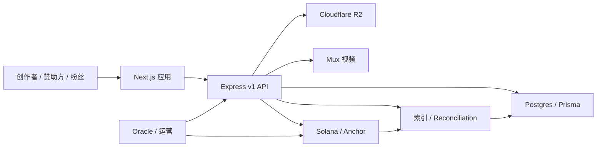

<p align="center">
  <h1 align="center">🎬 StreamPump</h1>
  <p align="center">
    <strong>面向创作者赞助的 Web2.5 信任层——把内容创作、创作者势能、粉丝参与和赞助预算，放进同一个产品闭环，并在 Solana 上结算。</strong>
  </p>
  <p align="center">
    
    
    
    
    
  </p>
  <p align="center">
    <a href="README.md">🇬🇧 English README</a>
  </p>
  
</p>

---

## 📋 目录

- [这是什么？](#-这是什么)
- [StreamPump 凭什么不一样](#-streampump-凭什么不一样)
- [核心能力](#-核心能力)
- [界面预览](#-界面预览)
- [产品模型](#-产品模型)
- [工作原理](#-工作原理)
- [为什么选择 Solana](#-为什么选择-solana)
- [当前状态](#-当前状态)
- [仓库结构](#-仓库结构)
- [本地启动](#-本地启动)
- [技术栈](#-技术栈)
- [Demo 路径](#-demo-路径)
- [测试](#-测试)
- [部署](#-部署)
- [路线图](#-路线图)
- [文档索引](#-文档索引)
- [安全与 Git](#-安全与-git)
- [许可](#-许可)

---

## ✨ 这是什么？

**StreamPump** 是一个构建在 Solana 上的 Web2.5 创作者赞助市场。它把内容创作、创作者势能、赞助预算、粉丝参与和链上结算放进同一个产品闭环。

它**不是** fan token 赌场，**不是**传统 influencer CRM，也**不是** view-to-earn 刷量农场。它是三方之间缺失的那一层——**信任层**：

- **创作者**：先从粉丝处获得冷启动资金，再毕业进入结构化赞助，既有保底报酬，也有表现激励。
- **粉丝 / 支持者**：用非转让的 `SPUMP` 早期支持创作者；当赞助方买断你看好的创作者时，你赚到真实的 **USDC**——而不是靠二级市场投机。
- **赞助方**：无需中介代理，直接触达创作者，通过三条灵活的 USDC 预算轨道投放，并拿到可验证的链上活动凭证。

```text
内容 → 创作者势能 → 粉丝参与 → 赞助方 USDC 预算 → Solana 结算
```

> **设计原则：** 产品流程 DB-first，资金事实 chain-first。草稿、上传、内容清单、proposal intent 都在 Postgres 里流转；出资、结算、token 流动以 Solana 为最终事实。

---

## 🔥 StreamPump 凭什么不一样

创作者经济预计到 **2027 年达到 4800 亿美元**（高盛），美国创作者广告支出已达 **370 亿美元**（IAB 2025），且 **73%** 的品牌现在更偏好与中腰部创作者合作而非头部网红。需求已经存在——**缺的是信任层。**

Web3 试图切入这个市场，但大多失败了，而且是结构性失败：

| 项目 | 发生了什么 |
|---|---|
| **Friend.tech** | 日活约 8 万 → **不足 1 万**；收入崩到 **71 美元**；团队弃用合约 |
| **Farcaster** | 融资 **1.5 亿美元**；新注册从 **1.5 万/月 跌到 545/月** |
| **Lens Protocol** | 新用户从 **3.7 万/月 跌到 142/月**——暴跌 **99.6%** |

三个结构性问题害死了它们：**token 优先而非产品优先**、**view-to-earn 死亡螺旋**（赚 token → DEX 抛售 → 价格崩盘 → 用户流失）、以及**没人真正想要的"虚假内容所有权"**。

StreamPump 建立在四个核心信念之上，正好规避了上述每一个陷阱：

| 信念 | 含义 |
|---|---|
| 🎥 **内容才是资产** | 视频和帖子能长期留住受众——meme 币和 NFT 只吸引投机者。我们不主张拥有、也不把内容代币化；链上只存一条创作者签名的发布时间戳 + 归属记录用于分配收益，内容仍留在创作者自己的平台上 |
| 🔒 **`SPUMP` 仅作工具** | 非转让的 Token-2022；永不上 DEX/CEX。backing 是**用时间和注意力计价、而非用钱**的 skin in the game——不可转让正是让它成为可信信念信号的机制，而非妥协 |
| 💼 **赞助方是营销支出方** | 投放的是活动预算而非投机资本——这是更健康的资金来源 |
| ⚙️ **天然自动化** | 不靠臃肿团队或榨取式 tokenomics；靠服务费 + 小额 USDC 交易费维持运转 |

---

## 🎯 核心能力

| 能力 | 说明 |
|---|---|
| 🚀 **S1 创作者发现** | 粉丝 burn `SPUMP` 进入按评级调整的 bonding-curve 头寸，早期支持创作者 |
| 🤝 **S1 → S2 买断桥接** | 赞助方出 USDC 买断创作者；持有者可 rage-quit 退出，或在毕业时按比例领取分成 |
| 📊 **三轨赞助** | 固定保底、表现预算、延迟 CPS——每条轨道独立链上结算 |
| 🗳️ **粉丝背书池** | 粉丝 burn `SPUMP` 背书活动，从 Track 2 表现池按比例赚取 USDC |
| 🔗 **可验证活动凭证** | 每个活动都暴露其 PDA、交易签名、manifest hash 和内容锚定 |
| 👛 **Web2.5 托管钱包** | 邮箱/社交登录用户获得平台代管钱包——后端签名并代付，全程零 SOL |
| 🛡️ **反投机护栏** | 非转让 token、每日买入上限、动态退出税、延迟评级、背书上限 |
| 🎞️ **真实媒体管线** | Cloudflare R2 存储 + Mux 视频处理 + 进入公开 feed 前的发布验证 |

---

## 📸 界面预览

| 发现页 | 热门创作者 |
|---|---|
|  |  |

| 资产页 | 内容详情 |
|---|---|
|  |  |

---

## 🧩 产品模型

StreamPump 有两个相互衔接的产品层。

### S1——创作者发现市场

S1 是创作者进入赞助市场前的发现层。粉丝 burn `SPUMP`（非转让 Token-2022），获得记录在 `S1UserPosition` 里的**内部创作者头寸**（以 PDA 形式存储，**不是**可交易的 SPL token）。价格沿二次 bonding curve 移动，并由 oracle 评估的 momentum 评级缩放：

```text
effective_k = base_k * creator_rating_bps / 10_000
buy cost    = effective_k / 2 * ((S + dS)^2 - S^2)
sell return = effective_k / 2 * (S^2 - (S - dS)^2)
```

默认评级为 `10_000`（1.0×），区间 `5_000`–`20_000`（0.5×–2.0×），带每日变动上限和延迟生效。当创作者达到临界规模，赞助方提交**买断报价**；创作者接受并经过 rage-quit 窗口后，执行**毕业**，剩余持有者按比例领取买断 USDC。

> 参数与反套利护栏详见 [docs/protocol/s1-market-design.md](docs/protocol/s1-market-design.md)。

### S2——赞助活动市场

赞助方通过三条预算轨道为活动出资：

| 轨道 | 模式 | 结算 |
|---|---|---|
| **Track 1** | 固定保底 | 无条件支付给创作者 |
| **Track 2** | 表现预算 | 达到 cliff 阈值后，80% 给创作者 / 20% 进粉丝背书池 |
| **Track 3** | CPS（按销售付费） | 退款窗口关闭后延迟结算 |

发起流程在资金移动前 DB-first，资金移动时 chain-first：

```text
钱包会话
  → 内容 manifest
  → proposal intent
  → 创作者部分签名
  → 赞助方最终签名
  → Solana proposal + 注资 vault
  → 分轨结算
```

### 忠诚度与粉丝牌（设计）

> 🧭 **设计 / 规划中——尚未实现。** 规范见 [docs/protocol/fan-loyalty-and-spump-economy.md](docs/protocol/fan-loyalty-and-spump-economy.md)。

在 S1/S2 之上叠加一个忠诚度层，把"早期粉丝"身份做成具体可见的东西，并为 `SPUMP` 提供随时可用的消耗汇。每个粉丝对每个创作者持有一枚**灵魂绑定的粉丝牌**，按关注时长加互动升级，早期 cohort 支持者获得永久的**创始粉 #N** 排名。`SPUMP` 被定位为信念/声音——而非钱——因此不可转让是优点：正因为它只能靠时间赚取，花掉它才是真实信念的可信信号。粉丝牌升级、打赏（cheer）、内容助推（boost）和功能解锁都会 burn `SPUMP`，让它的用处不再取决于"当下有没有值得 back 的创作者"；同时每个创作者的 S1 每日上限随粉丝牌等级缩放，让忠诚度（而非资金量）赢得 backing 优先权。

---

## 🏗 工作原理



- **工作流 DB-first：** 草稿、manifest、上传、媒体处理、proposal intent、重试、workspace 状态。
- **资金 chain-first：** 赞助出资、proposal 创建、结算、退款、token mint/burn、不可变内容锚定。

Anchor 程序提供 **32 个类型安全指令**和 **13 个 PDA 账户类型**，覆盖完整生命周期——S1 发现、S1 买断、S2 活动、三轨结算、内容锚定，以及协议/用户/组织状态。

---

## ⚡ 为什么选择 Solana

每个核心机制都依赖 Solana 的某个特定能力——这不是营销话术：

| 能力 | 为什么重要 |
|---|---|
| **约 400ms 终局性** | S1 bonding-curve 买卖必须即时确认，体验才可用 |
| **不到 1 美分手续费** | 让 Track 2 微结算和 Track 3 CPS 支付在经济上可行 |
| **Token-2022 NonTransferable** | 在协议层强制 `SPUMP` 不可转让，而非靠约定 |
| **PDA 架构** | 配置、档案、S1 头寸、proposal、USDC vault 都是确定性、可验证的链上状态 |
| **Anchor 框架** | 整个产品生命周期的 32 个类型安全指令集于一个程序 |
| **生态** | 钱包适配器、Web3Auth 社交登录、成熟 RPC，以及用于快速迭代的 devnet |

---

## 📍 当前状态

StreamPump 是一个认真推进的原型，并已有一条**经过端到端验证的生产走廊**（已认证创作者 → 媒体上传 → 公开 feed → proposal → 双签发起 → 链上活动凭证）。部分界面仍处于受控 demo 或运营驱动阶段，readiness 标签保持如实。

| 区域 | Readiness | 当前真实能力 |
|---|---|---|
| **生产走廊** | ✅ 端到端验证 | 认证 → R2/Mux 媒体 → feed → proposal intent → 双签 → Solana → 活动凭证 |
| **S1 市场买卖** | `SEEDED_DEMO` | 钱包会话下针对种子 devnet 状态进行实时买卖 |
| **S1 资产 / 领取** | `SEEDED_DEMO` | 从已毕业的买断头寸领取 USDC |
| **S1 买断生命周期** | `BACKEND_READY_UI_GAP` + `OPERATOR_REQUIRED` | 链上 + builder 完整；workspace UI 仍为预览 |
| **S2 proposal 发起** | `SEEDED_DEMO` | 完整走廊已验证 |
| **S2 背书** | `SEEDED_DEMO` + `BACKEND_READY_UI_GAP` | 种子 proposal 的链上 burn + 后端 build/submit |
| **结算 Track 1/2** | `OPERATOR_REQUIRED` | 可针对受控数据运行 |
| **结算 Track 3（CPS）** | `MOCK_PREVIEW` + `OPERATOR_REQUIRED` | 受控——需要真实商户/对账提供方 |
| **托管钱包签名** | 进行中 | 后端托管签名路径已实现；生产需 KMS + 程序部署 |
| **奖励** | `MOCK_PREVIEW` | 托管每日领取路径已接线；任务仍为预览 |
| **运营工具** | `OPERATOR_REQUIRED` | 内部路由已具备；尚无后台面板 |

> ⚠️ Anchor 程序**未经审计**，请勿用于真实资金。新的链上护栏和奖励逻辑需要先部署程序才能在链上生效。

### 合规与代币定性（设计推进中）

`SPUMP` 是非转让的效用/消耗单位，**无货币价值、无利润预期**。为了让 backing 保持为有代价的信念信号、同时**不**构成投资合同，backer 的 USDC 机制正在从"按持仓比例分买断款"（当前链上代码仍是这样实现的）重新定性为**有上限、由平台出资、且不随 staked `SPUMP` 数量缩放的发现/忠诚奖励**——以永久的创始身份、而非 USDC 作为主奖励。面向公众的真实资金上线，门槛包括：这套重设计、地域限制、对收 USDC 用户的 KYC、一次 Anchor 审计，以及一份法律代币定性意见书。详见 [docs/protocol/spump-compliance-and-value-model.md](docs/protocol/spump-compliance-and-value-model.md)。在此之前，所有 USDC 奖励流都应视为仅 demo/种子用途。

完整情况见 [docs/streamPump-long-term-roadmap.md](docs/streamPump-long-term-roadmap.md)（权威路线图 + 进度账本）与 [docs/product-readiness-phase-0.md](docs/product-readiness-phase-0.md)。

---

## 📦 仓库结构

| 路径 | 作用 |
|---|---|
| `programs/streampump-core` | Anchor 程序：协议状态、S1、S1 买断、S2 三轨结算、内容锚定 |
| `programs/tests` | 10 个 Anchor TypeScript 测试套件（happy/unhappy、guard、buyout、S2 流程） |
| `backend` | Express v1 API、Prisma（22 模型 / 17 迁移）、R2/Mux、认证、索引、调度器、投影 |
| `app` | Next.js 15 前端：发现、创作者、资产、workspace、campaign、认证等界面 |
| `docs` | 协议设计、后端 API 合同、前端规范、部署说明、路线图 |
| `scripts` | devnet seed、demo、smoke、部署和 git hook 脚本 |
| `local-post-assets` | 本地开发 feed 和媒体 smoke 用的种子素材 |
| `third_party` | Anchor workspace 使用的 vendored Rust 依赖 |

---

## 🚀 本地启动

**前置要求：** Node.js 20+、npm、Rust toolchain、Solana CLI + Anchor（用于链上测试）、Postgres。

```bash
# 安装依赖（三个独立目标——无 monorepo 工具）
npm install
npm install --prefix app
npm install --prefix backend

# 创建本地环境变量文件（真实密钥只填进 .env.local——已被 Git 忽略）
cp app/.env.example app/.env.local
cp backend/.env.example backend/.env.local
```

### 前端

```bash
cd app
npm run dev          # http://localhost:3000
```

关键环境变量：

```text
NEXT_PUBLIC_BACKEND_BASE_URL=http://localhost:4000
NEXT_PUBLIC_RPC_ENDPOINT=https://api.devnet.solana.com
NEXT_IMAGE_REMOTE_HOSTS=pub-b0acd300bcec4dc5ba5ea36628dd809f.r2.dev
NEXT_PUBLIC_WEB3AUTH_CLIENT_ID=...
```

前端会自动从 `NEXT_PUBLIC_BACKEND_BASE_URL` 推导 `/api/v1`。

### 后端

```bash
cd backend
npm run prisma:generate
npm run build
npm run dev          # http://localhost:4000
```

常用环境变量：`DATABASE_URL`、`DIRECT_URL`、`AUTH_SESSION_SECRET`、`SOLANA_RPC_ENDPOINT`、`STREAMPUMP_PROGRAM_ID`、`R2_*`、`MUX_*`、`MANAGED_WALLET_ENCRYPTION_KEY`。详见 [docs/backend/env-and-vendor-guide.md](docs/backend/env-and-vendor-guide.md)。

### 链上程序

```bash
npm run build:anchor   # 产物输出到 /private/tmp，规避 macOS 文件同步卡顿
anchor test
cargo check            # 更轻量的类型检查
```

---

## 🛠 技术栈

| 层级 | 技术 |
|---|---|
| **Solana 程序** | Rust + Anchor 0.32、Solana CLI 2.3.0、Token-2022（NonTransferable mint） |
| **后端** | Express 4、TypeScript 5、Prisma 6、PostgreSQL |
| **前端** | Next.js 15、React 18、Tailwind CSS 3、TypeScript 5 |
| **对象存储** | Cloudflare R2（经 AWS SDK S3 传输） |
| **视频** | Mux（上传、webhook、reconciliation、HLS） |
| **认证** | 钱包适配器（Phantom、Solflare）、Web3Auth、邮箱 OTP、钱包挑战 |
| **部署** | Vercel（前端）、Render（后端）、Neon（DB）、Cloudflare R2、Mux |
| **Program ID** | `FYphzoVLs1MB7aqHbGeT2DjqwTz1d6yyhtKXzvmjiDmp` |

---

## 🎬 Demo 路径

线上 demo 刻意收敛为两条受控流程：

```text
S1 受控 demo
  → seed devnet S1 市场 + 已毕业买断
  → 打开 /market/:creatorWallet → 钱包会话下买卖 S1
  → 打开 /buyout/:creatorWallet → 从种子持有头寸领取 USDC
  → 验证 /portfolio 读模型

S2 活动 demo
  → 钱包登录 → 内容 manifest → proposal intent
  → 创作者签一次 launch bundle → 赞助方签名并提交一次
  → 确认的 Solana 活动
  → campaign 详情展示 PDA、交易签名、manifest hash、内容锚定、轨道状态
```

完整 runbook、环境开关、seed 脚本和验收清单见 [DEMO.md](DEMO.md)。

> **边界说明：** S1 买断形成和 S2 Track 3 对账在 demo 中由运营/种子脚本准备，不作为真实的外部集成呈现。

---

## 🧪 测试

```bash
npm run build --prefix app
npm run build --prefix backend
cargo check
npm run test:backend        # 15 个后端套件
npm run test:anchor         # 10 个 Anchor 套件（需本地 validator）
```

聚焦套件：

```bash
npm run test:s1:happy
npm run test:s1:unhappy
npm run test:s1:buyout
npm run test:s1:buyout:unhappy
npm run test:s2:unhappy
```

---

## ☁️ 部署

| 模块 | 平台 |
|---|---|
| 前端 | Vercel（root directory `app`，build `next build`） |
| 后端 | Render（root directory `backend`） |
| 数据库 | Neon / Postgres |
| 对象存储 | Cloudflare R2 |
| 视频 | Mux |

Render build / start：

```bash
npm ci --include=dev && npm run prisma:generate && npm run build
npm run start
```

应用生产迁移：

```bash
cd backend && npm run prisma:migrate:deploy
```

详见 [docs/backend/vercel-render-deployment.md](docs/backend/vercel-render-deployment.md)。

---

## 🗺 路线图

近期优先级：

- 持续硬化已验证的生产走廊（认证 → 媒体 → feed → proposal → 活动凭证）。
- 完成生产级身份验证和托管钱包硬化（KMS/Vault、SOL 预算、恢复/导出）。
- 在受控 S1 demo 路径稳定后，产品化 S1 买断形成 UI。
- 完成 S2 背书领取体验和粉丝奖励账本。
- 为 oracle、风控审核、对账和结算监控添加运营后台。
- 构建忠诚度/粉丝牌层与 `SPUMP` 消耗汇（打赏、助推、等级领取）——见 [docs/protocol/fan-loyalty-and-spump-economy.md](docs/protocol/fan-loyalty-and-spump-economy.md)。
- 在任何真实资金部署前进行更全面的安全审查。

---

## 📚 文档索引

- [DEMO.md](DEMO.md) — 受控 S1/S2 demo runbook
- [docs/streamPump-long-term-roadmap.md](docs/streamPump-long-term-roadmap.md) — 权威路线图 + 进度账本
- [docs/product-readiness-phase-0.md](docs/product-readiness-phase-0.md) — 黑客松后 readiness 边界
- [docs/protocol/s1-market-design.md](docs/protocol/s1-market-design.md) — S1 经济模型与护栏
- [docs/protocol/fan-loyalty-and-spump-economy.md](docs/protocol/fan-loyalty-and-spump-economy.md) — 忠诚度/粉丝牌层与 SPUMP 消耗汇（设计）
- [docs/protocol/spump-compliance-and-value-model.md](docs/protocol/spump-compliance-and-value-model.md) — 证券合规定性与 SPUMP 价值模型（设计）
- [docs/protocol/content-attribution-and-anchoring.md](docs/protocol/content-attribution-and-anchoring.md) — 诚实的内容锚定模型：归属而非所有权（设计）
- [docs/backend/proposal-launch-api-contract.md](docs/backend/proposal-launch-api-contract.md) — DB-first 发起合同
- [docs/backend/env-and-vendor-guide.md](docs/backend/env-and-vendor-guide.md) — 后端环境与供应商配置
- [docs/frontend/design.md](docs/frontend/design.md) — 前端设计体系

---

## 🔒 安全与 Git

```bash
./scripts/install-git-hooks.sh   # 在提交前阻止常见密钥模式
```

真实凭据不应写入 `.env.example`、文档、截图或 demo 日志。托管钱包密钥经 AES-256-GCM 加密，运行时需提供 `MANAGED_WALLET_ENCRYPTION_KEY`——切勿提交该密钥。

---

## 📄 许可

本仓库采用双许可结构：

- `programs/` 下的链上程序使用 [Apache License 2.0](programs/LICENSE)
- 后端、前端、脚本和文档使用 [Business Source License 1.1](LICENSE)

BSL 允许个人学习、testnet 实验、学术研究和向本项目贡献代码。商业使用需要单独授权。**2030 年 4 月 20 日**起，所有 BSL 覆盖的代码自动转换为 Apache License 2.0。

---

<p align="center">
  <sub>为创作者、粉丝以及为他们出资的赞助方而建——在 Solana 上结算。❤️</sub>
</p>
