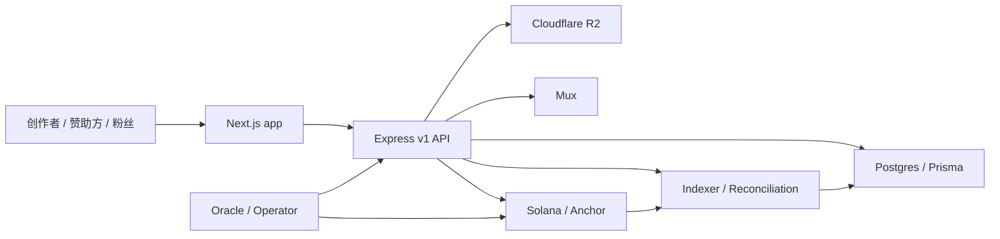

# StreamPump 中文介绍

StreamPump 是一个 Web2.5 创作者赞助市场原型。它不是单纯的 fan token 项目，也不是传统的 influencer CRM，而是把内容创作、创作者势能、赞助预算、粉丝参与和 Solana 结算放在同一个产品闭环里。

## 当前状态

这个仓库是一个认真推进中的产品原型，包含前端、后端和 Solana Anchor 程序三部分。

| 层级 | 当前能力 | 需要注意的边界 |
| --- | --- | --- |
| Solana 程序 | 已实现 S1 创作者发现、S1 buyout、S2 proposal 创建、赞助方出资、三轨预算结算、内容 hash 锚定、协议/用户/组织状态等 Anchor 指令 | 仍属于原型阶段，未经过正式审计，不应直接用于真实资金生产环境 |
| 后端 | Express v1 API、Prisma/Postgres 数据模型、内容清单、proposal intent、交易 bundle、公开 feed、市场投影、Cloudflare R2、Mux、索引和 reconciliation 服务 | 生产级身份校验、运营后台、完整媒体审核和部署硬化仍需继续完善 |
| 前端 | Next.js 用户侧界面，包括 Explore、Trending、Creator、Post、Portfolio、Me、Activity、Workspace、Campaign 等页面 | 正在把协议、后端读模型和钱包签名流程逐步接入完整产品体验 |

## 核心产品模型

### S1：创作者发现市场

S1 是创作者进入赞助市场前的发现层。用户通过参与行为获得 `SPUMP`，再用 `SPUMP` 支持早期创作者。这里有两个关键资产：

- `SPUMP`：非转让的 Token-2022 参与资产，用于协议内部的参与、奖励和消耗。
- S1 creator position：记录在 `S1UserPosition` 里的创作者虚拟头寸，不是 SPL token，不能转让。

用户买入 S1 曝光时会 burn `SPUMP`，并增加某个创作者下的内部虚拟份额；卖出时由协议 PDA mint 回 `SPUMP`，并可能扣除动态退出税。价格曲线会根据创作者 momentum rating 调整：

```text
effective_k = base_k * creator_rating_bps / 10_000
buy cost = effective_k / 2 * ((S + dS)^2 - S^2)
sell return = effective_k / 2 * (S^2 - (S - dS)^2)
```

S1 还包含从发现到 S2 的 buyout / graduation 桥接机制。赞助方可以提交买断报价，创作者接受后进入执行期，持有者可以在规则允许的窗口内退出或之后领取对应 USDC。当前仓库已经包含 S1 happy path、unhappy path、guard 和 buyout 相关测试，后端也提供了 S1 action transaction build / submit / status 路由。

### S2：赞助活动市场

S2 承载 StreamPump 的创作者赞助活动流程。赞助活动用三条预算轨道表达不同的商业目标：

| 预算轨道 | 用途 |
| --- | --- |
| Track 1 | 创作者固定基础报酬 |
| Track 2 | 基于播放、点击、收藏等可验证指标的表现预算 |
| Track 3 | 带延迟窗口的 CPS 风格结算预算 |

S2 的关键设计是 **DB-first 工作流 + Chain-first 资金事实**：

```text
wallet session
  -> content manifest
  -> proposal intent
  -> creator partial signature
  -> sponsor final signature
  -> Solana proposal + funded vault
  -> campaign settlement
```

内容草稿、媒体上传、proposal intent、交易 bundle 和重试状态先在数据库里流转；当资金需要移动时，以 Solana 链上的 proposal、vault、settlement 交易作为最终事实。

## 技术架构

StreamPump 采用混合架构：

- 前端：Next.js 14、React 18、Solana wallet adapter、Web3Auth 脚手架。
- 后端：Express、TypeScript、Prisma、Postgres。
- 媒体：Cloudflare R2 作为对象存储，Mux 处理视频资产。
- 链上：Solana、Anchor、Token-2022、SPL Token。
- 后台任务：索引、oracle / reconciliation scheduler、市场投影服务。



## 仓库结构

| 路径 | 作用 |
| --- | --- |
| `programs/streampump-core` | Anchor 链上程序，包含协议状态、S1、S1 buyout、S2 proposal 和 settlement |
| `programs/tests` | Anchor TypeScript 测试，覆盖 happy path、unhappy path、guard、buyout 和 S2 流程 |
| `backend` | Express API、Prisma schema、认证、内容清单、Mux/R2、索引、调度器和市场投影 |
| `app` | Next.js 前端，包含发现页、创作者页、内容页、用户资产页、workspace 和 campaign 页面 |
| `docs` | 协议设计、后端 API 合同、前端设计、部署说明和进度复盘 |
| `local-post-assets` | 本地开发用的 feed 和媒体种子资产 |
| `scripts` | 本地辅助脚本、demo seed、devnet smoke、视频封面生成和 git hooks |
| `third_party` | Anchor workspace 使用的 vendored Rust 依赖 |

## 本地启动

前置要求：

- Node.js 20+
- npm
- Rust toolchain
- Solana CLI 和 Anchor
- Postgres

安装依赖：

```bash
npm install
npm install --prefix app
npm install --prefix backend
```

创建本地环境变量文件：

```bash
cp app/.env.example app/.env.local
cp backend/.env.example backend/.env.local
```

前端开发：

```bash
cd app
npm run dev
```

常用前端环境变量：

```text
NEXT_PUBLIC_BACKEND_BASE_URL=http://localhost:4000
NEXT_PUBLIC_RPC_ENDPOINT=https://api.devnet.solana.com
NEXT_IMAGE_REMOTE_HOSTS=pub-b0acd300bcec4dc5ba5ea36628dd809f.r2.dev
NEXT_PUBLIC_WEB3AUTH_CLIENT_ID=...
```

后端开发：

```bash
cd backend
npm run prisma:generate
npm run build
npm run dev
```

常用后端环境变量包括：

```text
DATABASE_URL
DIRECT_URL
PORT
API_BASE_URL
CORS_ALLOWED_ORIGINS
AUTH_SESSION_SECRET
SOLANA_RPC_ENDPOINT
STREAMPUMP_PROGRAM_ID
R2_REGION
R2_BUCKET
R2_ENDPOINT
R2_ACCESS_KEY_ID
R2_SECRET_ACCESS_KEY
R2_PUBLIC_BASE_URL
MUX_*
```

构建 Anchor 程序：

```bash
npm run build:anchor
```

`npm run build:anchor` 默认把 Cargo / Anchor artifact 放到 `/private/tmp/streampump-anchor-target`，用于规避 macOS Desktop / iCloud 文件同步导致的构建卡住问题。

## 测试命令

常用检查：

```bash
npm run build --prefix app
npm run build --prefix backend
cargo check
npm run test:backend
npm run test:anchor
```

更聚焦的协议测试：

```bash
npm run test:s1:happy
npm run test:s1:unhappy
npm run test:s1:buyout
npm run test:s1:buyout:unhappy
npm run test:s2:unhappy
```

## 端到端流程

当前仓库已经形成的赞助活动发起流程：

```text
wallet sign-in
  -> content manifest
  -> proposal intent
  -> creator signs launch bundle once
  -> sponsor signs and submits once
  -> confirmed Solana campaign
  -> campaign detail shows PDA, tx signature, manifest hash, content anchor
```

更详细的运行步骤、环境开关、seed 脚本、devnet smoke 数据和验收清单见 `DEMO.md`。S1 相关流程可以通过本地 Anchor 测试和后端 S1 transaction builder 验证；S2 相关流程可以通过 proposal intent、交易 bundle 和 campaign 页面串起内容、签名、资金和链上凭证。

## 部署建议

推荐的第一版部署路径：

| 模块 | 建议平台 |
| --- | --- |
| 前端 | Vercel，root directory 设置为 `app` |
| 后端 | Render，root directory 设置为 `backend` |
| 数据库 | Neon / Postgres |
| 对象存储 | Cloudflare R2 |
| 视频处理 | Mux |

Vercel 侧关键配置：

```text
Root Directory: app
Build Command: next build
Required env vars: NEXT_PUBLIC_BACKEND_BASE_URL, NEXT_PUBLIC_RPC_ENDPOINT, NEXT_IMAGE_REMOTE_HOSTS
Optional env var: NEXT_PUBLIC_WEB3AUTH_CLIENT_ID
```

Render build command：

```bash
npm ci --include=dev && npm run prisma:generate && npm run build
```

Render start command：

```bash
npm run start
```

生产迁移：

```bash
cd backend
npm run prisma:migrate:deploy
```

更多部署细节见 `docs/backend/vercel-render-deployment.md`。

## 相关文档

- `DEMO.md`：当前 S2 demo runbook。
- `docs/protocol/s1-market-design.md`：S1 经济模型和风控边界。
- `docs/backend/proposal-launch-api-contract.md`：DB-first proposal launch 合同。
- `docs/backend/env-and-vendor-guide.md`：后端环境变量和供应商配置。
- `docs/backend/vercel-render-deployment.md`：Vercel / Render 部署说明。
- `docs/frontend/design.md`：前端设计方向。

## Git 与密钥安全

可以安装本地 git hook：

```bash
./scripts/install-git-hooks.sh
```

hook 会阻止常见密钥模式被提交。真实凭据只应放在本地 `.env.local` 或部署平台的环境变量中，不应写入 `.env.example`、文档、截图或 demo 日志。

## 许可

本仓库采用双许可结构：

- `programs/` 下的链上程序使用 Apache License 2.0。
- 后端、前端、脚本和文档使用 Business Source License 1.1。

BSL 覆盖的代码允许个人学习、testnet 实验、学术研究和向本项目贡献代码。商业使用需要 Licensor 单独授权。2030 年 4 月 20 日后，BSL 覆盖代码会自动转换为 Apache License 2.0。
